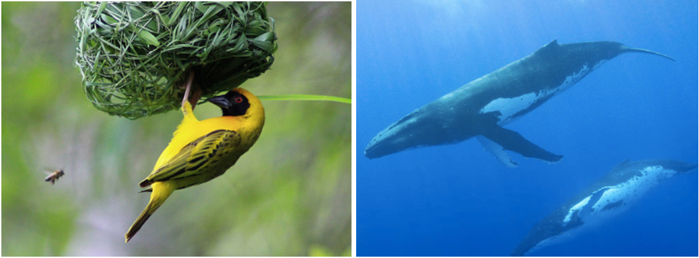
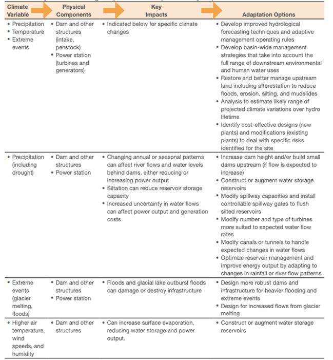
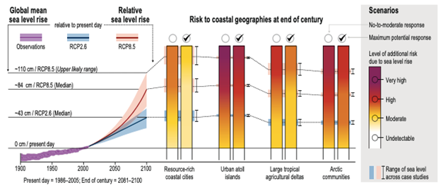

--- 
title: 'São Tomé and Príncipe National Adaptation Plan'
author: "Martha Teshome"
date: "`r Sys.Date()`"
site: bookdown::bookdown_site
documentclass: book
bibliography: [book.bib, packages.bib]
biblio-style: apalike
link-citations: yes
description: "São Tomé and Príncipe National Adaptation Plan"
---

# Prerequisites {-}
## Terms and Acronyms {-}

```{r, include=FALSE}
knitr::opts_chunk$set(echo = FALSE, message = FALSE, warning=FALSE)
``` 

```{r}
library(flextable)
library(magrittr)
acronyms<-readxl::read_excel("Tables_from_NAP.xlsx", 
    sheet = "acronyms")
t1<-flextable(acronyms,col_keys = names(acronyms),
  cwidth = 3,
  cheight = 0.01,
  defaults = list(),
   theme_booktabs())
t2<-fontsize(t1,part = 'all', size = 8)
t3<-bold(t2, j=1)
t3

```

## Executive Summary {-} 


```{r include=FALSE}
# automatically create a bib database for R packages
knitr::write_bib(c(
  .packages(), 'bookdown', 'knitr', 'rmarkdown'
), 'packages.bib')
```

<!--chapter:end:index.Rmd-->

# INTRODUCTION

The Democratic Republic of São Tomé and Príncipe is an archipelago…


<!--chapter:end:01-intro.Rmd-->

```{r, include=FALSE}
knitr::opts_chunk$set(echo = FALSE, message = FALSE, warning=FALSE)
``` 

# FRAMEWORK FOR THE NAP

##  Essential functions of the NAP process:

The process to embed adaptation into national policies has accelerated in both developed and developing countries. Substantial headway has been made in the development of climate change adaptation (CCA) strategies and plans, which include legislation and national strategies . The National Adaptation Plan (NAP) for Sao Tome and Principe will follow a dynamic, iterative approach that imparts elements of continuous learning and improvement. Key to this, is the collection of lessons learned from community-based activities that will address the context-specific elements of climate change adaptation together with emerging barriers and limits to adaptation. Indeed, there is no single approach to adaptation planning due to the multifarious nature of adaptation, and more often a mixed approach of both top-down and bottom-up interactions occurs. 

The ultimate objective for Sao Tome and Principe’s adaptation planning process is to shift from a project-based system towards a coordinated and coherent approach, across key vulnerable sectors and at all levels (Sao Tome and Principe Readiness and Preparatory Support Proposal, 2020). Linkages with local, subnational and national levels of government, incorporating the full participation of a broad range of stakeholders is imperative. Such approaches that lean on the traditional knowledge and technical expertise of the Saotomean society from national government officials and stakeholders to civil society organizations, academia and private sector actors, will stimulate dynamic responses in terms of climate change adaptation options and advance societal goals. 

While national governments largely adopt a coordinating role in adaptation planning and implementation, at the state and local levels climate change adaptation responses have diverse processes and outcomes (Mimura et al., n.d.). Local actors face the complexity of adaptation with insufficient technical guidance and data on local vulnerabilities and potential impacts. Yet given the availability of information, local agencies and planners are inundated with adaptation options needed to address future climatic changes (Mimura et al., n.d.). This coupled with the uncertain outcomes of their decisions and the complexities of dynamic interlocked systems, highlights the importance of strengthening vertical linkages within government and horizontal nodes between sectors, actors and policies functioning at comparable levels. Furthermore, enhanced action on adaptation should follow a country-driven, gender-sensitive, participatory approach, guided by the best available science and indigenous knowledge, taking into consideration vulnerable groups, communities and ecosystems (National Adaptation Plans, 2012).


##  The NAP as the umbrella programme for adaptation:

The NAP process in Sao Tome and Principe proposes a measured approach towards transforming the country’s ability to address climate change adaptation. In spite of the lack of a comprehensive institutional framework to set out a coordinated and cross-sectoral approach to adaptation, and the need for a national investment plan to guide climate change adaptation investments, the NAP is veritably integral to ensure a cohesive approach to adaptation planning at all levels. The NAP will serve as an umbrella programme for all climate change adaptation initiatives, projects and programs. It will enrich the collective actions undertaken and bridge the gaps with respect to climate data and information, capacity building, policy mainstreaming, adaptation finance and monitoring (Sao Tome and Principe Readiness and Preparatory Support Proposal, 2020).

In Sao Tome and Principe, the current institutional framework to support climate change adaptation comprises: 

*	The Ministry of Infrastructure, Natural Resources and Environment (MNREE), renamed Ministry of Public Works, Infrastructure and, Natural Resources and Environment (MPWINRE), which is accountable for the coordination of environmental issues through its General Directorate vision of Environment (GDE); the General Directoratevision of Natural Resources (GDNR) which is responsible for the integrated and sustainable management of natural resources (including water, mineral and petroleum resources); the National Committee for the Environment (CAN) that coordinates government initiatives related to sustainable development and the integration of environment issues into development strategies; and the Observatory for Environmental Information (OEI) who’s responsibilities include developing and maintaining a database of all environmental-related projects implemented in country for stakeholder dissemination.  
*	The National Institute of Meteorology (NIM), which is responsible for the collection, analysis, management and dissemination of weather and climate-related information. 
*	The National Disaster Preparedness and Response Council (CONPREC) in charge of coordination of disaster and climate risk management (D/CRM) activities and effective response to disasters. 
*	The National Committee on Climate Change (NCCC), which coordinates climate change mitigation and adaptation initiatives. 

The NAP intends to build on Sao Tome and Principe’s third National Communication, which complements the adaptation measures recommended in the previous versions of the National Communication, including the NAPA and a number of adaptation projects. It will undertake scientific analysis on local vulnerabilities and climate change impacts in key sectors of the economy, including agriculture and livestock, water resources and coastal zones. 


##  Climate change adaptation priorities identified in Sao Tome and Principe’s INDC

Sao Tome and Principe’s Intended Nationally Determined Contribution (INDC) spotlights climate change adaptation as a priority for national authorities. It calls for financial resources as well as technology and capacity building support through international assistance, to implement adaptation and mitigation measures. Adaptation measures in the INDC are aimed at improving the country’s ability to adapt to the adverse impacts of climate change as a means to contribute to national development. This rationale takes into consideration Sao Tome and Principe’s ecosystem services and its status as a sink of Greenhouse Gases (GHGs), with the capacity to sequester CO2 from the atmosphere. As a Small Island Developing State (SIDS), the country demonstrates conditions of vulnerability across all sectors of the national economy including agriculture and livestock; forest and soil; water, energy and fishing; coastal zone and population; and health and education (Sao Tome and Principe Intended Nationally Determined Contribution, 2015). 

Contingent on international funding, Sao Tome and Principle pledges to implement the following actions in the short to medium term : (I) strengthen the National Service of Civil Protection and Fire Brigade by 2025, to respond to fires and other environmental disasters, increasing resilience to climate change and contributing to social well-being; (II) reduce the number of people living in vulnerable at-risk areas by providing housing in safer areas; (III) develop a national program for sustainable management of forest and agroforestry ecosystems by 2025; (IV) introduce radar reflectors on board all fishing vessels by 2025, to reduce the number of accidents at sea; and (V) train and equip fishermen to ensure safe fishing and proper use of fishing gear. 

In conformance with the NAP technical guidelines, the NAP entails a medium- and long-term approach, integrated within national development planning processes and strategies to reduce vulnerability to the adverse impacts of climate change (National Adaptation Plans, 2012). In the medium to long term, Sao Tome and Principe has committed to implement adaptation activities subject to the availability of international support to subsidize their financial, technological and capacity-building needs. These include actions to: (I) reduce the illegal and indiscriminate felling of trees by 15% by 2030; (II) develop scientific and technical research on adaptation of new productive crop varieties with a broad spectrum of tolerance to adverse climate impacts by 2030; (III) promote forestry/planting of species resistant to dry and low rainfall by 2030; (IV) improve pasture with grazing selection by applying rotation management of the plots by 2030; (V) increase the resilience to erosion and maritime river and storm flooding of coastal areas through improved coastal protection for vulnerable communities; and (VI) reduce the use of nitrogen fertilizers in agriculture by 2030. 


##	  Gaps and barriers to adaptation as identified in the INDC: 

* Limited availability and access to climate change information  
*	Lack of access to a centralized database 
*	Lack of capacity building for national experts on specific issues 
*	Limited access to efficient and modern technologies 
*	Inadequate technological skills in the national marketplace 
*	Limited capacity of the National Climate Change Committee 
*	Lack of policies and regulations for key sectors
*	Limited access to finance
*	Limited state budgets to create an enabling environment for private sector investment
*	Relatively long period for returns on investment

##  Existing Initiatives and Projects on Climate Change Adaptation:


```{r}
library(flextable)
library(magrittr)
programs<-readxl::read_excel("Tables_from_NAP.xlsx", 
    sheet = "existing_programs")
t1<-flextable(programs,col_keys = names(programs),
  cwidth = 3,
  cheight = 0.01,
  defaults = list(),
   theme_booktabs())
t2<-fontsize(t1,part = 'all', size = 8)
t3<-border_outer(t2,part = 'all', border = NULL)
t4<-border_inner(t3,part = 'all', border = NULL)
t5<-set_caption(t4, "Existing Initiatives and Projects on Climate Change Adaptation ")
t5

```


##  Lessons from Sao Tome and Principe’s NAPA process:

On account of the United Nations Framework Convention on Climate Change’s (UNFCCC) Clean Development Mechanism (CDM), Sao Tome and Principe is a constituent of a group of countries that are categorized as carbon sinks, yet one that is particularly affected not only by climate change but also by the costs of adaptation and mitigation required to address it. All things considered, there is also a lack of appropriate adaptation solutions to address climate change in the country.  

Sao Tome and Principe’s NAPA narrowly focuses its efforts on assessing the country’s adaptation priorities. In this way, it seeks to: (1) develop and implement projects based on vulnerability to current and future impacts of climate change; (2) protect human life and ensure wellbeing, protect infrastructure and safeguard the environment; (3) integrate adaptation measures into national policies across all relevant sectors; and (4) increase knowledge of the impacts of climate change and of local and national level adaptation activities. 

Barriers to the implementation of the NAPA include limited capacity with regards to planning and execution of public administration development objectives. An evaluation of the institutional landscape within the country’s public administration indicates four key weaknesses that should be appropriately addressed, these constitute the lack of: political decision-making; organizational capacity and management; qualified human resources; and material and financial resources.  

In an effort to prioritize adaptation options, the NAPA selected projects through a multi-criteria analysis. The identification of criteria for climate vulnerable sectors was grounded on Sao Tome and Principe’s national priorities, including the specific and urgent needs of the population, poverty reduction with a focus on women and most vulnerable groups, in addition to the costs of adaptation options. The Saotomean government through the former Ministry of Public Works, Infrastructure, Natural Resources and Environment (MPWINRE), is responsible for the implementation of the NAPA and the adoption of recommendations contained within. 

The demonstration of a stakeholder approach is clear. The goal of the latest version of the NAPA is to create a list of priority adaptation options guided by local knowledge and the experience of communities. In its implementation however, the INDC and NAPA combined, call for international support programs on account of limited financial resources to address or minimize the adverse effects of climate change.


##  Coherence with the national development context, SDGs, SFDRR and other relevant frameworks:

Consistent with the Third National Communication, there is an apparent lack of integration of climate change considerations embedded into broader national systems governing sectoral and national development in Sao Tome and Principe. Effective training tools and coherent cross-sectoral strategies and polices guided by a comprehensive institutional framework is needed to respond to the issue of climate change within national development policies. Certainly, climate change is a concern for the Saotomean population and a tremendous challenge for policy makers and decision-makers alike. Hence, a well-coordinated fully transparent approach is crucial for effective integration of climate change adaptation into existing governance, decision-making and institutional frameworks

###	National Development Framework

The country has crafted a policy framework to address medium- and long-term priorities that foster poverty reduction and sustainable economic growth (Sao Tome and Principe Readiness and Preparatory Support Proposal, 2020). Sao Tome and Principe’s transformation agenda built on the Vision 2030 “the country we want”, spotlights the post-2015 national development priorities grounded on four key areas, which comprise: (1) good governance for a strong democracy, (2) sustainable economic growth, (3) human development, and (4) cross-cutting issues such as behaviors and values. The 2nd Poverty Reduction Strategic Paper (PRSP) 2012-2016 closely mirrors the thematic priorities highlighted in the Vision 2030, although it covers a medium-term outlook. The Plan of Priority Action (PPA) 2013-2016, developed by the former Ministry of Finance, Commerce and Blue Economy supports the implementation of the PRSP, per a dedicated budget and creates an enabling environment aimed at resource mobilization. The intended successor of the 2nd PSRP is the National Development Plan (NDP) 2017-2021. 

The NDP is designed upon five strategic objectives, which aim to: 

*	Improve the exploitation of the country's potential and strengthen its integration into the global economy, to achieve accelerated and sustainable economic growth, employment and poverty reduction 
*	Accelerate and deepen various reforms to significantly improve the human development index of Sao Tome and make substantial progress towards achieving SDGs by 2030 
*	Improve strategic management capacity for national development, strengthen good governance and democracy 
*	Develop infrastructure for energy, transport, water and sanitation, and promote the development of telecommunications and ICTs, to reduce the costs of production, improve living conditions of the population and explore the opportunities offered by the public-private partnership. 
*	Improve land management and preservation of the environment 

###	UNFCCC | Kyoto Protocol | Paris Agreement

Sao Tome and Principe demonstrated its firm commitment to tackling climate change by signing the United Nations Framework Convention on Climate Change (UNFCCC) in 1992, later ratified in 1999. The country is committed to the Convention and partakes in the Conference of the Parties (COP) meetings that convene every year to assess the effects of the measures taken by Parties and the progress made in achieving the central objective of the Convention. The process undertaken by Sao Tome and Principe resulted in studies, national emission inventories, projects and appropriate adaptation actions to address the harmful effects of climate change. The country was also a signatory to the Kyoto Protocol in 1997, which was ratified in 2008. In 2015, Sao Tome and Principe signed the Paris Agreement, conveying its continued commitment to dealing with climate change and its impacts.   

###	National Communication 

Sao Tome and Principe lacks a National Program that facilitates the integration of climate change considerations into national development plans and policies (Third National Communication, 2019). Albeit, with the exception of primary, secondary and higher education level initiatives aimed at integrating climate change considerations into curricula and teachers’ pedagogical trainings. The extension of the National Communications has contributed to increasing awareness of national actors responsible for advancing climate change issues and its integration into national development policies (Third National Communication, 2019). National planning authorities further expect to implement an ambitious and comprehensive reform agenda mentioned in part in the 2017-2022 National Development Plan, building on the ENRP-II. 

###	The 2030 Agenda and its SDGs

In the MDG era, Sao Tome and Principe achieved a number of MDG targets particularly Goal 2: Achieve universal primary education; Goal 3: Promote gender equality and empower women; and Goal 4: Reducing child mortality. Whereas, the implementation of the Sustainable Development Goals (SDGs) poses a pressing challenge for the country due to the ambitious nature of the global goals. For this reason, Sao Tome and Principe has prioritized 6 SDGs for implementation, which constitute: 

*	SDG 1: End poverty in all its forms, everywhere
*	SDG 8: Promote sustained, inclusive and sustainable economic growth, full and productive employment and decent work for all
*	SDG 9: Build resilient infrastructures, promote inclusive and sustainable industrialization and foster innovation
*	SDG 13: Take urgent action to combat climate change and its impacts 
*	SGD 15: Protect, restore and promote sustainable use of terrestrial ecosystems, sustainably manage forests, combat desertification, and halt and reverse land degradation and halt biodiversity loss
*	SDG 16: Promote peaceful and inclusive societies for sustainable development, provide access to justice for all, and build effective, accountable and inclusive institutions at all levels

###	Sendai Framework for Disaster Risk Reduction (SFDRR)

Sao Tome and Principe signed both the Hyogo Framework for Action (HFA) 2005-2015 and its successor, the Sendai Framework for Disaster Risk Reduction (SFDRR) 2015-2030. Through the interim phase of the Sendai Framework, the government led by the National Disaster Preparedness and Response Council (CONPREC) undertook an assessment of the national capacity to reduce the risk of disasters. The study highlighted the need to strengthen national coordination for disaster risk reduction along with disaster prevention, risk mitigation, preparedness, response, recovery and reconstruction . On account of the assessment, the Saotomean government further identified capacity needs and called for the establishment of a legal framework. Despite alignment with the Sendai Framework, the country lacks a national platform for disaster risk reduction that would serve as a coordination mechanism in the implementation, monitoring and review of the Sendai Framework to measure national level progress and reinforce effective coordination at all levels. National platforms for disaster risk reduction built through a nationally owned and led participatory process are multi-sectoral and interdisciplinary in nature and foster a multi-stakeholder composition in order to be effective and sustainable. 

Challenges in the establishment of a legal and policy framework for climate change :

While the country has increasingly prioritized the integration of climate change adaptation in the broader development framework, there are still a number of challenges that exist in the establishment of a legal and policy framework for climate change, these include: 

*	The lack of understanding among various governmental and non-governmental stakeholders about climate change impacts, vulnerability characteristics as well as available adaptation options and their effects on the population
*	Limited consideration of climate change and adaptation options into policies, strategies, plans and programmes especially at sectoral and local levels
*	No comprehensive institutional framework in place in order to guide, coordinate and follow-up CCA investments mostly coming from scattered projects across the country
*	Limited institutional, technical and financial capacity in the country to implement, monitor and maintain adaptation interventions


<!--chapter:end:02-literature.Rmd-->

# CLIMATE CHANGE ADAPTATION ASSESSMENT 

The principal objective of the vulnerability and adaptation assessment of key systems is to identify and assess projections of future climate change and the resulting risks and impacts. This adaptation assessment promotes priority adaptation actions that respond to current and future impacts of climate change on natural and human systems in Sao Tome and Principe, taking into consideration the specific needs of local communities and vulnerable groups. Each of the mega systems narrow down on key areas, critical to the advancement of Sao Tome and Principe’s sustainable development pathway. 

The climate system in Sao Tome and Principe is influenced by the annual migration and dynamics of the Inter Tropical Convergence Zone (ITCZ). The climate is characterized as complex on the basis of the nation being a small archipelago endowed with a unique orography. Air temperature and rainfall data are only available at five meteorological stations, four stations are situated in Sao Tome and one in Principe. What is more, only the Sao Tome Airport weather station can detect climate change due to its longer time series data compared to other meteorological stations across the island with data series of less than a decade.

The Representative Concentration Pathways (RCPs), which involve four different 21st century pathways of GHG emissions and atmospheric concentrations, air pollutant emissions and land use , were used to project their effects on local crop production within Sao Tome and Principe’s climate system. The RCPs help project the consequences under various climate scenarios and are useful for the country’s climate impacts and adaptation assessments. The RCP scenarios detailed in this NAP, which include intermediate scenario RCP4.5 and very high GHG emissions scenario (RCP8.5), are compared to the baseline which represents a scenario without additional efforts to constrain emissions . 

##	Exposure to Climate Impacts and Risks 

###	Current Climate (Baseline): 

Sao Tome and Principe is among 13 countries uniquely situated along the equator. Its characterized by a humid tropical climate with two seasons: a shorter dry season (gravana), which lasts approximately three months from June to August and a longer rainy season that extends to nine months from September to May. The seasons are influenced by the location of the Inter-Tropical Convergence Zone (ITCZ), which significantly affects rainfall in many equatorial countries. Longer term shifts in the ITCZ can lead to extreme droughts or flooding in neighboring regions. The ITCZ migrates from the southern hemisphere to the North, causing the peak of the rainy season to occur on average from February to May and then again from October to December when the ITCZ migrates back south. The period of roughly two months between December and January, referred to as Gravanito, experiences a slight reduction in rainfall. 

Given the characteristics of the archipelago, Sao Tome and Principe which has an average surface temperature of 25.6° C, has many microclimates predominately as a function of rainfall, temperature and topographical relief. It therefor follows that temperatures drop as altitude increases. This includes Pico de Sao Tome which sits at an elevation of 2024m in the central west part of the island and Pico de Principe at an altitude of 948m in the southern region. The country’s orographic precipitation is determined by the volcanic massifs that result in rainfall gradients, which offer significant water potential. The highest annual average rainfall of 7000mm is recorded in the southwest region of the island of Sao Tome (Quijá and Xufe-xufe river basins), which is home to dense tropical forests. The savanna is located in the northeastern parts of the island, where rainfall is measured at an annual average of below 1000mm. Parts of the northern regions of the island, namely the districts of Água Grande and Lobata, experience an average monthly rainfall of below 50mm during gravana. There are marked complexities of engaging in horticulture without irrigation, particularly in light of the fact that the highest population densities are situated in these regions. 

```{r, include=FALSE}
knitr::opts_chunk$set(echo = FALSE, message = FALSE, warning=FALSE)
``` 

```{r,include=FALSE}

library(raster)
library(rasterVis)
library(reshape)
library(dplyr)
library(lubridate)
library(tidyr)
library(magrittr)
library(R.utils)
library(sf)
library(plotly)
library(ggplot2)
library(rgee)
library(flextable)
library(FAOSTAT)
library(reticulate)
library(magick)


```


```{r geom-extent,include=FALSE}
STP0<-getData('GADM', country='STP', level=0)
STP1<-getData('GADM', country='STP', level=1)
STP2<-getData('GADM', country='STP', level=2)
#getData('ISO3')

STP2.sf<-st_as_sf(STP2)
STP2.split1<-split(STP2.sf, STP2.sf$NAME_1)
ST<-STP2.split1$`São Tomé`
PCP<-STP2.split1$Príncipe
#plot(STP2.sf$geometry)

STP_regions<-split(STP2.sf, STP2.sf$NAME_2)
pague<-STP_regions$Pagué
grande<-STP_regions$`Água Grande`
cantagalo<-STP_regions$Cantagalo
caue<-STP_regions$Caué
lemba<-STP_regions$Lembá
lobata<-STP_regions$Lobata
zochi<-STP_regions$`Mé-Zóchi`

# GAUL from gee
ee_Initialize()

admin0<-ee$FeatureCollection("FAO/GAUL/2015/level0")
admin2<-ee$FeatureCollection("FAO/GAUL/2015/level2")

stp0<- admin0$filter(ee$Filter$eq('ADM0_NAME', 'Sao Tome and Principe'))
stp2<- admin2$filter(ee$Filter$eq('ADM0_NAME', 'Sao Tome and Principe'))

stp0_sf<-ee_as_sf(stp0)
stp2_sf<-ee_as_sf(stp2) 

stp2_split<-split(stp2_sf, stp2_sf$ADM1_NAME)

saoT<-stp2_split$`Sao Tome`
principe<-stp2_split$Principe

```


### National

```{r}

Tmax<-ee$ImageCollection("IDAHO_EPSCOR/TERRACLIMATE")$
  select('tmmx')

Tmax_stp0<-ee_extract(x=Tmax, y=stp0_sf, fun=ee$Reducer$mean())
#Tmax_stp2<-ee_extract(x=Tmax, y=stp2_sf, fun=ee$Reducer$mean())

Tmaxlong<-pivot_longer(Tmax_stp0,cols = 9:764,names_to = 'month',values_to = 'tmax')
Tmaxlong$Date<-seq(as.Date('1958-01-01'), by="month", length.out=756)

Tmaxlong$tmax<-Tmaxlong$tmax*0.1
 

tmax_ann<-Tmaxlong%>%mutate(year=year(Date), month=month(Date))%>%
  group_by(year)%>%  summarise(tmax=mean(tmax))

tmax_mon<-Tmaxlong%>%mutate(year=year(Date), month=month(Date))%>%
  group_by(month)%>%  summarise(tmax=mean(tmax))

#tmax_ts<-xts(Tmaxlong$tmax,Tmaxlong$Date)

tmax_mon$month<-factor(tmax_mon$month,levels = c('7','8','9','10','11','12','1','2','3','4','5','6')) # reorder the months to start plotting from july to june

#Tmin
Tmin<-ee$ImageCollection("IDAHO_EPSCOR/TERRACLIMATE")$
  select('tmmn')

Tmin_stp0<-ee_extract(x=Tmin, y=stp0_sf, fun=ee$Reducer$mean())
#Tmin_stp2<-ee_extract(x=Tmin, y=stp2_sf, fun=ee$Reducer$mean())

Tminlong<-pivot_longer(Tmin_stp0,cols = 9:764,names_to = 'month',values_to = 'tmin')
Tminlong$Date<-seq(as.Date('1958-01-01'), by="month", length.out=756)
Tminlong$tmin<-Tminlong$tmin*0.1
 
tmin_ann<-Tminlong%>%mutate(year=year(Date), month=month(Date))%>%
  group_by(year)%>%  summarise(tmin=mean(tmin))

tmin_mon<-Tminlong%>%mutate(year=year(Date), month=month(Date))%>%
  group_by(month)%>%  summarise(tmin=mean(tmin))

mytemp<-cbind(Tmaxlong[,10:11], Tminlong[,10])
mytemp$tmean<-(mytemp$tmax+mytemp$tmin)/2

#pr
pr<-ee$ImageCollection("IDAHO_EPSCOR/TERRACLIMATE")$
  select('pr')

pr_stp0<-ee_extract(x=pr, y=stp0_sf, fun=ee$Reducer$mean())
#pr_stp2<-ee_extract(x=pr, y=stp2_sf, fun=ee$Reducer$mean())

prlong<-pivot_longer(pr_stp0,cols = 9:764,names_to = 'month',values_to = 'pr')
prlong$Date<-seq(as.Date('1958-01-01'), by="month", length.out=756)

pr_ann<-prlong%>%mutate(year=year(Date), month=month(Date))%>%
  group_by(year)%>%  summarise(pr=mean(pr))

pr_mon<-prlong%>%mutate(year=year(Date), month=month(Date))%>%
  group_by(month)%>%  summarise(pr=mean(pr))

#pr_ts<-xts(prlong$pr,prlong$Date)

#combine pr and temp
pr_temp<-cbind(mytemp,prlong[,10])

df_mon<-pr_temp%>%mutate(year=year(Date), month=month(Date))%>%
  group_by(month)%>%  summarise(pr=mean(pr),tmean=mean(tmean))
df_mon$month<-factor(df_mon$month, 
                     levels = c('7','8','9','10','11','12','1','2','3','4','5','6'))


# sec. axis
ty<-list(overlaying = "y",
  side = "right",
  title = "Temperature (°C)",
  autotick = F,
  showticklabels=T,
      dtick = 5,
 range=c(20,28)
  )

# plot
plotly::plot_ly(type= 'bar', data= df_mon, x= ~month, y= ~pr, name = 'Precipitation')%>%
  plotly::add_lines(x= ~month, y= ~tmean, name= 'Temperature', yaxis='y2')%>%
  plotly::add_markers(x= ~month, y= ~tmean, color='#D21919', yaxis='y2', name='', showlegend=F)%>%
    plotly::layout(legend=list(orientation='h', y=-0.08,x=0.7), yaxis=list(title='Precipitation (mm)',showticklables=T), title='Sao Tome and Principe \n (Mean 1958-2020)', yaxis2=ty)

```

### Sao Tome

```{r}
Tmax<-ee$ImageCollection("IDAHO_EPSCOR/TERRACLIMATE")$
  select('tmmx')

Tmax_saoT<-ee_extract(x=Tmax, y=saoT, fun=ee$Reducer$mean())
#Tmax_stp2<-ee_extract(x=Tmax, y=stp2_sf, fun=ee$Reducer$mean())

Tmaxlong<-pivot_longer(Tmax_saoT,cols = 13:768,names_to = 'month',values_to = 'tmax')
Tmaxlong$Date<-seq(as.Date('1958-01-01'), by="month", length.out=756)

Tmaxlong$tmax<-Tmaxlong$tmax*0.1
 

tmax_ann<-Tmaxlong%>%mutate(year=year(Date), month=month(Date))%>%
  group_by(year)%>%  summarise(tmax=mean(tmax))

tmax_mon<-Tmaxlong%>%mutate(year=year(Date), month=month(Date))%>%
  group_by(month)%>%  summarise(tmax=mean(tmax))

#tmax_ts<-xts(Tmaxlong$tmax,Tmaxlong$Date)


#Tmin
Tmin<-ee$ImageCollection("IDAHO_EPSCOR/TERRACLIMATE")$
  select('tmmn')

Tmin_saoT<-ee_extract(x=Tmin, y=saoT, fun=ee$Reducer$mean())
#Tmin_stp2<-ee_extract(x=Tmin, y=stp2_sf, fun=ee$Reducer$mean())

Tminlong<-pivot_longer(Tmin_saoT,cols = 13:768,names_to = 'month',values_to = 'tmin')
Tminlong$Date<-seq(as.Date('1958-01-01'), by="month", length.out=756)
Tminlong$tmin<-Tminlong$tmin*0.1
 
tmin_ann<-Tminlong%>%mutate(year=year(Date), month=month(Date))%>%
  group_by(year)%>%  summarise(tmin=mean(tmin))

tmin_mon<-Tminlong%>%mutate(year=year(Date), month=month(Date))%>%
  group_by(month)%>%  summarise(tmin=mean(tmin))

mytemp<-cbind(Tmaxlong[,14:15], Tminlong[,14])
mytemp$tmean<-(mytemp$tmax+mytemp$tmin)/2

#pr
pr<-ee$ImageCollection("IDAHO_EPSCOR/TERRACLIMATE")$
  select('pr')

pr_saoT<-ee_extract(x=pr, y=saoT, fun=ee$Reducer$mean())
#pr_stp2<-ee_extract(x=pr, y=stp2_sf, fun=ee$Reducer$mean())

prlong<-pivot_longer(pr_saoT,cols = 13:768,names_to = 'month',values_to = 'pr')
prlong$Date<-seq(as.Date('1958-01-01'), by="month", length.out=756)

pr_ann<-prlong%>%mutate(year=year(Date), month=month(Date))%>%
  group_by(year)%>%  summarise(pr=mean(pr))

pr_mon<-prlong%>%mutate(year=year(Date), month=month(Date))%>%
  group_by(month)%>%  summarise(pr=mean(pr))

#pr_ts<-xts(prlong$pr,prlong$Date)

#combine pr and temp
pr_temp<-cbind(mytemp,prlong[,14])

df_mon<-pr_temp%>%mutate(year=year(Date), month=month(Date))%>%
  group_by(month)%>%  summarise(pr=mean(pr),tmean=mean(tmean))

df_mon$month<-factor(df_mon$month, 
                     levels = c('7','8','9','10','11','12','1','2','3','4','5','6'))


# plot

ty<-list(overlaying = "y",
  side = "right",
  title = "Temperature (°C)",
  autotick = F,
  showticklabels=T,
      dtick = 5,
 range=c(20,30)
  )

plotly::plot_ly(type= 'bar', data= df_mon, x= ~month, y= ~pr, name = 'Precipitation')%>%
  plotly::add_lines(x= ~month, y= ~tmean, mode = 'lines+markers',name= 'Temperature', yaxis='y2')%>%
  plotly::add_markers(x= ~month, y= ~tmean, color='#D21919', yaxis='y2', name='', showlegend=F)%>%
    plotly::layout(legend=list(orientation='h', y=-0.08,x=0.7), yaxis=list(title='Precipitation (mm)',showticklables=F),width=700, height=450, title='Sao Tome \n (Mean 1958-2020)', yaxis2=ty)

```

### Principe
```{r}
Tmax<-ee$ImageCollection("IDAHO_EPSCOR/TERRACLIMATE")$
  select('tmmx')

Tmax_principe<-ee_extract(x=Tmax, y=principe, fun=ee$Reducer$mean())
#Tmax_stp2<-ee_extract(x=Tmax, y=stp2_sf, fun=ee$Reducer$mean())

Tmaxlong<-pivot_longer(Tmax_principe,cols = 13:768,names_to = 'month',values_to = 'tmax')
Tmaxlong$Date<-seq(as.Date('1958-01-01'), by="month", length.out=756)

Tmaxlong$tmax<-Tmaxlong$tmax*0.1
 

tmax_ann<-Tmaxlong%>%mutate(year=year(Date), month=month(Date))%>%
  group_by(year)%>%  summarise(tmax=mean(tmax))

tmax_mon<-Tmaxlong%>%mutate(year=year(Date), month=month(Date))%>%
  group_by(month)%>%  summarise(tmax=mean(tmax))

#tmax_ts<-xts(Tmaxlong$tmax,Tmaxlong$Date)


#Tmin
Tmin<-ee$ImageCollection("IDAHO_EPSCOR/TERRACLIMATE")$
  select('tmmn')

Tmin_principe<-ee_extract(x=Tmin, y=principe, fun=ee$Reducer$mean())
#Tmin_stp2<-ee_extract(x=Tmin, y=stp2_sf, fun=ee$Reducer$mean())

Tminlong<-pivot_longer(Tmin_principe,cols = 13:768,names_to = 'month',values_to = 'tmin')
Tminlong$Date<-seq(as.Date('1958-01-01'), by="month", length.out=756)
Tminlong$tmin<-Tminlong$tmin*0.1
 
tmin_ann<-Tminlong%>%mutate(year=year(Date), month=month(Date))%>%
  group_by(year)%>%  summarise(tmin=mean(tmin))

tmin_mon<-Tminlong%>%mutate(year=year(Date), month=month(Date))%>%
  group_by(month)%>%  summarise(tmin=mean(tmin))

mytemp<-cbind(Tmaxlong[,14:15], Tminlong[,14])
mytemp$tmean<-(mytemp$tmax+mytemp$tmin)/2

#pr
pr<-ee$ImageCollection("IDAHO_EPSCOR/TERRACLIMATE")$
  select('pr')

pr_principe<-ee_extract(x=pr, y=principe, fun=ee$Reducer$mean())
#pr_stp2<-ee_extract(x=pr, y=stp2_sf, fun=ee$Reducer$mean())

prlong<-pivot_longer(pr_principe,cols = 13:768,names_to = 'month',values_to = 'pr')
prlong$Date<-seq(as.Date('1958-01-01'), by="month", length.out=756)

pr_ann<-prlong%>%mutate(year=year(Date), month=month(Date))%>%
  group_by(year)%>%  summarise(pr=mean(pr))

pr_mon<-prlong%>%mutate(year=year(Date), month=month(Date))%>%
  group_by(month)%>%  summarise(pr=mean(pr))

#pr_ts<-xts(prlong$pr,prlong$Date)

#combine pr and temp
pr_temp<-cbind(mytemp,prlong[,14])

df_mon<-pr_temp%>%mutate(year=year(Date), month=month(Date))%>%
  group_by(month)%>%  summarise(pr=mean(pr),tmean=mean(tmean))

df_mon$month<-factor(df_mon$month, 
                     levels = c('7','8','9','10','11','12','1','2','3','4','5','6'))


# plot

ty<-list(overlaying = "y",
  side = "right",
  title = "Temperature (°C)",
  autotick = F,
  showticklabels=T,
      dtick = 5,
 range=c(20,30)
  )

plotly::plot_ly(type= 'bar', data= df_mon, x= ~month, y= ~pr, name = 'Precipitation')%>%
  plotly::add_lines(x= ~month, y= ~tmean, mode = 'lines+markers',name= 'Temperature', yaxis='y2')%>%
  plotly::add_markers(x= ~month, y= ~tmean, color='#D21919', yaxis='y2', name='', showlegend=F)%>%
    plotly::layout(legend=list(orientation='h', y=-0.08,x=0.7), yaxis=list(title='Precipitation (mm)',showticklables=F),width=700, height=450, title='Principe \n (Mean 1958-2020)', yaxis2=ty)

```


###	Emerging Climate Trends: 

Warming of temperatures and reductions in rainfall are of paramount importance to Saotomeans as this can set off a decrease in the river flow and affect the availability of subterranean water. In certain regions of Sao Tome and Principe climate impacts such as sea-level rise, flooding and coastal erosion have been observed at levels that risk damage and destruction to major infrastructure. According to the baseline, RCP4.5 and RCP8.5 scenarios, the annual average temperature trend reported by Sao Tome Airport’s weather station, indicates an increase of 0.6 °C between 1960 and 2016, representing an average warming of around 0.01 °C per year . The warming comes into effect from the months of October until May. The highest annual average temperature of 26.2 °C was recorded in 1998, whereas the lowest annual average temperature of 24.7 °C was recorded in 1964. This demonstrates an increase in interannual variability of the climate in Sao Tome and Principe. Notably, the five warmest years to-date have occurred in the last 20 years, which further indicates an increasing trend of warming of annual average temperatures.  

Parallel to other countries in West Africa, temperature observations in Sao Tome and Principe reveal an increasing trend in temperature. The figures below, based on climate analysis from 1970 to 2015, demonstrate an average increase in temperature. Trends in average annual precipitation, however, are not clearly defined and are variable in time and space. 


  


 _Rainfall Anomaly_

```{r, eval=FALSE}

# mean pr 1901-2019
pr <- read.table("CRU.CY.4.04.PRE_STP.txt", header=TRUE, quote="\"", stringsAsFactors=TRUE)

mpr<-pr[,c(-1,-14,-15,-16,-17,-18)]
annpr<-pr[,c(1,18)]

# base 1961-1990
base81<-subset(annpr, YEAR>1960)%>%subset( YEAR<1991)

meanbase<-sum(base81$ANN)/30
  
annpr$anomaly<-annpr$ANN-meanbase

annpr$pos<-annpr$anomaly >=0

annpr%>%dplyr::filter(YEAR>1950)%>%
ggplot()+
  geom_col(aes(x = YEAR, y = anomaly, fill = pos),position = "identity", colour = "white", size = 0.01) +
  labs(x='Year', y= 'Precipitation Anomaly (mm)')+
      ggtitle('Sao Tome & Principe \n(Base: 1961-1990)')+
  scale_fill_manual(values = c('red', 'blue'), guide = 'none')

```


```{r}

# mean pr 1901-2019
pr <- read.table("CRU.CY.4.04.PRE_STP.txt", header=TRUE, quote="\"", stringsAsFactors=TRUE)

mpr<-pr[,c(-1,-14,-15,-16,-17,-18)]
annpr<-pr[,c(1,18)]

# base 1981-2010
base81<-subset(annpr, YEAR>1980)%>%subset( YEAR<2011)

meanbase<-sum(base81$ANN)/30
  
annpr$anomaly<-annpr$ANN-meanbase

annpr$pos<-annpr$anomaly >=0

annpr%>%dplyr::filter(YEAR>1950)%>%
ggplot()+
  geom_col(aes(x = YEAR, y = anomaly, fill = pos),position = "identity", colour = "white", size = 0.01) + ggtitle('Sao Tome & Principe \n(Base: 1981-2010)')+
  labs(x='Year', y= 'Precipitation Anomaly (mm)')+
  scale_fill_manual(values = c('red', 'blue'), guide = "none")

```
 

_Source: Disaster Risk Profile São Tomé and Príncipe: Building Disaster Resilience to Natural Hazards in Sub-Saharan African Regions, Countries and Communities. (2018). UNISDR._


_Temperature Anomaly_

```{r, eval=FALSE}

# mean temp 1901-2019
TEMP <- read.table("CRU.CY.4.04.TMP_STP.txt", header=TRUE, quote="\"", stringsAsFactors=TRUE)

mtemp<-TEMP[,c(-1,-14,-15,-16,-17,-18)]
anntemp<-TEMP[,c(1,18)]

# base 1961-1990
base81<-subset(anntemp, YEAR>1960)%>%subset( YEAR<1991)

meanbase<-sum(base81$ANN)/30
  
anntemp$anomaly<-anntemp$ANN-meanbase

anntemp$pos<-anntemp$anomaly >=0

anntemp%>%dplyr::filter(YEAR>1950)%>%
ggplot()+
  geom_col(aes(x = YEAR, y = anomaly, fill = pos),position = "identity", colour = "white", size = 0.01) +
  labs(x='Year', y= 'Temperature Anomaly (°C)')+
  ggtitle('Sao Tome and Principe \n(Base: 1961-1990)')+
  scale_fill_manual(values = c('blue', 'red'), guide = 'none')

```

```{r}

# mean temp 1901-2019
TEMP <- read.table("CRU.CY.4.04.TMP_STP.txt", header=TRUE, quote="\"", stringsAsFactors=TRUE)

mtemp<-TEMP[,c(-1,-14,-15,-16,-17,-18)]
anntemp<-TEMP[,c(1,18)]

# base 1981-2010
base81<-subset(anntemp, YEAR>1980)%>%subset( YEAR<2011)

meanbase<-sum(base81$ANN)/30
  
anntemp$anomaly<-anntemp$ANN-meanbase

anntemp$pos<-anntemp$anomaly >=0

anntemp%>%dplyr::filter(YEAR>1950)%>%
ggplot()+
  geom_col(aes(x = YEAR, y = anomaly, fill = pos),position = "identity", colour = "white", size = 0.01) + ggtitle('Sao Tome and Principe \n(Base: 1981-2010)')+
  labs(x='Year', y= 'Temperature Anomaly (°C)')+
  scale_fill_manual(values = c('blue', 'red'), guide = "none")

```


###	Future Climate Scenarios: Projected Future Climate 

A climate-based study on Sao Tome and Principe, detailed in the Third National Communication, observed changes in total rainfall during the rainy season and dry season for the 2041–2070 period.
In the RCP4.5 scenario, rainfall projections predict a rainier climate from October to May (rainy season) and normal to dry conditions from June to September (dry season). In the RCP8.5 scenario, projections indicate a reduction in rainfall for both rainy and dry periods, with the exception of December and January based on a monthly analysis which demonstrates an increase in rainfall on the island of Sao Tome. This stands in contrast to the country’s gravanito period under the baseline scenario where rainfall typically decreases in the months of December and January. In terms of climate extremes, projections show a surge in total annual rainfall under RCP4.5 and an increase in rainfall intensity under both scenarios, particularly in the Caué and Lembá districts in the southwestern region of the island of Sao Tome. Further to this, there is a rise in the number of consecutive dry days that signals a prolonged dry season (gravana) and uneven temporal distribution of rainfall in the region. With respect to extreme temperature, climate projections under both scenarios (RCP4.5 and RCP8.5) indicate warming, with a surge in heat waves on hot days and an increase in annual minimum temperatures. 


 
_Source: Third National Communication of Sao Tome and Principe within the UNFCCC. (2019). Ministry of Public Works, Infrastructures, Natural Resources and the Environment._

###	Regional Projections:

As it concerns regional projections, under RCP4.5, global models predict an increase in rainfall in West Africa between the months of October to March. There is a variation in rainfall of about 10% to 20% over the 1986-2005 reference period. The climate models for the periods 2016–2035, 2046–2065, and 2081–2100 indicate that changes in temperature are consistent across the models. In the middle of the 21st century, specifically for the years 2046–2065, the average temperature increase ranges from 1° to 2°C in the Gulf of Guinea. A slight increase in average rainfall for the period 2036–2065 is observed, particularly from May to September during gravana in the Gulf of Guinea, including the islands of Sao Tome and Principe. 


_Source: IPCC, 2013: Annex I: Atlas of Global and Regional Climate Projections_

###	Local Projections: 

Local climate change projections for the 2041–2070 period is based on the 1971–2000 period, for which projections indicate warming of temperatures in the study belt, principally from October to May. During gravana warming is more pronounced in the central region of Sao Tome, where the altitude is highest. All in all, warming trends under both RCP4.5 and RCP8.5 is comparable, with an increase in intensity of warming in the RCP8.5 scenario. For both the rainy season and dry season under both scenarios, local scale projections do not demonstrate changes in annual temperature across the islands of Sao Tome and Principe.     


__Mean Temperature change 2021-2040 based on climatological period 1971-2000__

```{r, include=FALSE,cache=TRUE}
wc.tmin<-getData("worldclim", var='tmin', res=2.5)
wc.tmax<-getData("worldclim", var='tmax', res=2.5)
wc.tmean<-(wc.tmin+wc.tmax)/2

gain(wc.tmean)<-0.1
stp.tmean<-crop(wc.tmean,stp0_sf)%>%raster::mask(stp0_sf)
basemn<-sum(stp.tmean)/12
#plot(basenorth)

#admin1
saoT.tmean<-raster::crop(wc.tmean,saoT)%>%raster::mask(saoT)
basesaoT<-sum(saoT.tmean)/12

principe.tmean<-raster::crop(wc.tmean,principe)%>%raster::mask(principe)
baseprincipe<-sum(principe.tmean)/12

```

                              National 

```{r}
par(mfrow=c(2,2),mar=c(1, 0, 2.2, 3))

# 126
tn126.40<-raster("C:/Users/Makabe/opennaps/WC_Fut_data/tmin126/wc2.1_2.5m_tmin_BCC-CSM2-MR_ssp126_2021-2040.tif")%>%raster::crop(stp0_sf)%>%raster::mask(stp0_sf)
tx126.40<-raster("C:/Users/Makabe/opennaps/WC_Fut_data/tmax126/wc2.1_2.5m_tmax_BCC-CSM2-MR_ssp126_2021-2040.tif")%>%raster::crop(stp0_sf)%>%raster::mask(stp0_sf)
tmn126.40<-(tn126.40+tx126.40)/2
#plot(tmn126.40)
tvar126<-tmn126.40-basemn

plot(tvar126, main='SSP1 - Sustainability', axes=F, box=F, legend=F,col=heat.colors(10, rev = T))
plot(STP2.sf$geometry, add=T,lwd=0.001)

# 245
tn245.40<-raster("C:/Users/Makabe/opennaps/WC_Fut_data/tmin245/wc2.1_2.5m_tmin_BCC-CSM2-MR_ssp245_2021-2040.tif")%>%raster::crop(stp0_sf)%>%raster::mask(stp0_sf)
tx245.40<-raster("C:/Users/Makabe/opennaps/WC_Fut_data/tmax245/wc2.1_2.5m_tmax_BCC-CSM2-MR_ssp245_2021-2040.tif")%>%raster::crop(stp0_sf)%>%raster::mask(stp0_sf)
tmn245.40<-(tn245.40+tx245.40)/2
#plot(tmn245.40)
tvar245<-tmn245.40-basemn

plot(tvar245,main='SSP2 - Middle of the Road', axes=F, box=F, legend=F,col=heat.colors(10, rev = T))
plot(STP2.sf$geometry, add=T,lwd=0.001)


# 370
tn370.40<-raster("C:/Users/Makabe/opennaps/WC_Fut_data/tmin370/wc2.1_2.5m_tmin_BCC-CSM2-MR_ssp370_2021-2040.tif")%>%raster::crop(stp0_sf)%>%raster::mask(stp0_sf)
tx370.40<-raster("C:/Users/Makabe/opennaps/WC_Fut_data/tmax370/wc2.1_2.5m_tmax_BCC-CSM2-MR_ssp370_2021-2040.tif")%>%raster::crop(stp0_sf)%>%raster::mask(stp0_sf)
tmn370.40<-(tn370.40+tx370.40)/2
#plot(tmn370.40)
tvar370<-tmn370.40-basemn

plot(tvar370, main='SSP3 - Regional Rivalry', axes=F, legend.only=FALSE, horizontal = FALSE,legend.args = list(text='°C', side = 3, line = 1),box=F,col=heat.colors(10, rev = T))
plot(STP2.sf$geometry, add=T,lwd=0.001)

#585
tn585.40<-raster("C:/Users/Makabe/opennaps/WC_Fut_data/tmin585/wc2.1_2.5m_tmin_BCC-CSM2-MR_ssp585_2021-2040.tif")%>%raster::crop(stp0_sf)%>%raster::mask(stp0_sf)
tx585.40<-raster("C:/Users/Makabe/opennaps/WC_Fut_data/tmax585/wc2.1_2.5m_tmax_BCC-CSM2-MR_ssp585_2021-2040.tif")%>%raster::crop(stp0_sf)%>%raster::mask(stp0_sf)
tmn585.40<-(tn585.40+tx585.40)/2
#plot(tmn585.40)
tvar585<-tmn585.40-basemn

plot(tvar585,main='SSP5 - Fossil-fueled Development', axes=F, box=F, legend=F,col=heat.colors(10, rev = T))
plot(STP2.sf$geometry, add=T, lwd=0.001)


```
                                  
                                  Sao Tome 
                                  
```{r}
par(mfrow=c(2,2),mar=c(1, 0, 2.2, 3))

# 126
tn126.40<-raster("C:/Users/Makabe/opennaps/WC_Fut_data/tmin126/wc2.1_2.5m_tmin_BCC-CSM2-MR_ssp126_2021-2040.tif")%>%raster::crop(saoT)%>%raster::mask(saoT)
tx126.40<-raster("C:/Users/Makabe/opennaps/WC_Fut_data/tmax126/wc2.1_2.5m_tmax_BCC-CSM2-MR_ssp126_2021-2040.tif")%>%raster::crop(saoT)%>%raster::mask(saoT)
tmn126.40<-(tn126.40+tx126.40)/2
#plot(tmn126.40)
tvar126<-tmn126.40-basesaoT

plot(tvar126, main='SSP1 - Sustainability', axes=F, box=F, legend=F,col=heat.colors(10,rev = T))
plot(ST$geometry, add=T,lwd=0.001)

# 245
tn245.40<-raster("C:/Users/Makabe/opennaps/WC_Fut_data/tmin245/wc2.1_2.5m_tmin_BCC-CSM2-MR_ssp245_2021-2040.tif")%>%raster::crop(saoT)%>%raster::mask(saoT)
tx245.40<-raster("C:/Users/Makabe/opennaps/WC_Fut_data/tmax245/wc2.1_2.5m_tmax_BCC-CSM2-MR_ssp245_2021-2040.tif")%>%raster::crop(saoT)%>%raster::mask(saoT)
tmn245.40<-(tn245.40+tx245.40)/2
#plot(tmn245.40)
tvar245<-tmn245.40-basesaoT

plot(tvar245,main='SSP2 - Middle of the Road', axes=F, box=F, legend=F,col=heat.colors(10,rev = T))
plot(ST$geometry, add=T,lwd=0.001)


# 370
tn370.40<-raster("C:/Users/Makabe/opennaps/WC_Fut_data/tmin370/wc2.1_2.5m_tmin_BCC-CSM2-MR_ssp370_2021-2040.tif")%>%raster::crop(saoT)%>%raster::mask(saoT)
tx370.40<-raster("C:/Users/Makabe/opennaps/WC_Fut_data/tmax370/wc2.1_2.5m_tmax_BCC-CSM2-MR_ssp370_2021-2040.tif")%>%raster::crop(saoT)%>%raster::mask(saoT)
tmn370.40<-(tn370.40+tx370.40)/2
#plot(tmn370.40)
tvar370<-tmn370.40-basesaoT

plot(tvar370, main='SSP3 - Regional Rivalry', axes=F, legend.only=FALSE, horizontal = FALSE,legend.args = list(text='°C', side = 3, line = 1),box=F,col=heat.colors(10,rev = T))
plot(ST$geometry, add=T,lwd=0.001)

#585
tn585.40<-raster("C:/Users/Makabe/opennaps/WC_Fut_data/tmin585/wc2.1_2.5m_tmin_BCC-CSM2-MR_ssp585_2021-2040.tif")%>%raster::crop(saoT)%>%raster::mask(saoT)
tx585.40<-raster("C:/Users/Makabe/opennaps/WC_Fut_data/tmax585/wc2.1_2.5m_tmax_BCC-CSM2-MR_ssp585_2021-2040.tif")%>%raster::crop(saoT)%>%raster::mask(saoT)
tmn585.40<-(tn585.40+tx585.40)/2
#plot(tmn585.40)
tvar585<-tmn585.40-basesaoT

plot(tvar585,main='SSP5 - Fossil-fueled Development', axes=F, box=F, legend=F, col=heat.colors(10, rev = T))
plot(ST$geometry, add=T, lwd=0.001)


```

                                    Principe

```{r}
par(mfrow=c(2,2),mar=c(1, 0, 2.2, 3))

# 126
tn126.40<-raster("C:/Users/Makabe/opennaps/WC_Fut_data/tmin126/wc2.1_2.5m_tmin_BCC-CSM2-MR_ssp126_2021-2040.tif")%>%raster::crop(principe)%>%raster::mask(principe)
tx126.40<-raster("C:/Users/Makabe/opennaps/WC_Fut_data/tmax126/wc2.1_2.5m_tmax_BCC-CSM2-MR_ssp126_2021-2040.tif")%>%raster::crop(principe)%>%raster::mask(principe)
tmn126.40<-(tn126.40+tx126.40)/2
#plot(tmn126.40)
tvar126<-tmn126.40-baseprincipe

plot(tvar126, main='SSP1 - Sustainability', axes=F, box=F, legend=F,col=heat.colors(10, rev = T))
plot(PCP$geometry, add=T,lwd=0.001)

# 245
tn245.40<-raster("C:/Users/Makabe/opennaps/WC_Fut_data/tmin245/wc2.1_2.5m_tmin_BCC-CSM2-MR_ssp245_2021-2040.tif")%>%raster::crop(principe)%>%raster::mask(principe)
tx245.40<-raster("C:/Users/Makabe/opennaps/WC_Fut_data/tmax245/wc2.1_2.5m_tmax_BCC-CSM2-MR_ssp245_2021-2040.tif")%>%raster::crop(principe)%>%raster::mask(principe)
tmn245.40<-(tn245.40+tx245.40)/2
#plot(tmn245.40)
tvar245<-tmn245.40-baseprincipe

plot(tvar245,main='SSP2 - Middle of the Road', axes=F, box=F, legend=F,col=heat.colors(10, rev = T))
plot(PCP$geometry, add=T,lwd=0.001)


# 370
tn370.40<-raster("C:/Users/Makabe/opennaps/WC_Fut_data/tmin370/wc2.1_2.5m_tmin_BCC-CSM2-MR_ssp370_2021-2040.tif")%>%raster::crop(principe)%>%raster::mask(principe)
tx370.40<-raster("C:/Users/Makabe/opennaps/WC_Fut_data/tmax370/wc2.1_2.5m_tmax_BCC-CSM2-MR_ssp370_2021-2040.tif")%>%raster::crop(principe)%>%raster::mask(principe)
tmn370.40<-(tn370.40+tx370.40)/2
#plot(tmn370.40)
tvar370<-tmn370.40-baseprincipe

plot(tvar370, main='SSP3 - Regional Rivalry', axes=F,legend.only=FALSE, horizontal = FALSE,legend.args = list(text='°C', side = 3, line = 1), box=F,col=heat.colors(10, rev = T))
plot(PCP$geometry, add=T,lwd=0.001)

#585
tn585.40<-raster("C:/Users/Makabe/opennaps/WC_Fut_data/tmin585/wc2.1_2.5m_tmin_BCC-CSM2-MR_ssp585_2021-2040.tif")%>%raster::crop(principe)%>%raster::mask(principe)
tx585.40<-raster("C:/Users/Makabe/opennaps/WC_Fut_data/tmax585/wc2.1_2.5m_tmax_BCC-CSM2-MR_ssp585_2021-2040.tif")%>%raster::crop(principe)%>%raster::mask(principe)
tmn585.40<-(tn585.40+tx585.40)/2
#plot(tmn585.40)
tvar585<-tmn585.40-baseprincipe

plot(tvar585,main='SSP5 - Fossil-fueled Development', axes=F, box=F, legend=F,col=heat.colors(10, rev = T))
plot(PCP$geometry, add=T, lwd=0.001)


```


__Precipitation change 2021-2040 based on climatologial period 1971-2000__

```{r, include=FALSE,cache=TRUE}
wc.prec<-getData("worldclim", var='prec', res=2.5)
stp.prec<-crop(wc.prec,stp0_sf)%>%raster::mask(stp0_sf)
pr.basemn<-sum(stp.prec)/12
#plot(pr.basemn)
#baseglob<-sum(wc.prec)/12

#admin1
saoT.pr<-raster::crop(wc.prec,saoT)%>%raster::mask(saoT)
pr.basesaoT<-sum(saoT.pr)/12

principe.pr<-raster::crop(wc.prec,principe)%>%raster::mask(principe)
pr.baseprincipe<-sum(principe.pr)/12


```

                              National
                              
```{r}
par(mfrow=c(2,2),mar=c(1, 0, 2, 2))

# 126
pr126.40<-raster("C:/Users/Makabe/opennaps/WC_Fut_data/pr126/wc2.1_2.5m_prec_BCC-CSM2-MR_ssp126_2021-2040.tif")%>%raster::crop(stp0_sf)%>%raster::mask(stp0_sf)
#plot(pr126.40)
prvar126<-pr126.40-pr.basemn

plot(prvar126, axes=F, box=F, main='SSP1 - Sustainability', legend=F)
plot(STP2.sf$geometry, add=T)

# 245
pr245.40<-raster("C:/Users/Makabe/opennaps/WC_Fut_data/pr245/wc2.1_2.5m_prec_BCC-CSM2-MR_ssp245_2021-2040.tif")%>%raster::crop(stp0_sf)%>%raster::mask(stp0_sf)
#plot(pr245.40)
prvar245<-pr245.40-pr.basemn

plot(prvar245, axes=F, box=F, main='SSP2 - Middle of the Road', legend=F)
plot(STP2.sf$geometry, add=T)

# 370
pr370.40<-raster("C:/Users/Makabe/opennaps/WC_Fut_data/pr370/wc2.1_2.5m_prec_BCC-CSM2-MR_ssp370_2021-2040.tif")%>%raster::crop(stp0_sf)%>%raster::mask(stp0_sf)
#plot(pr370.40)
prvar370<-pr370.40-pr.basemn

plot(prvar370, axes=F, box=F,legend.only=FALSE, horizontal = FALSE,legend.args = list(text='mm', side = 3, line = 1), main='SSP3 - Regional Rivalry')
plot(STP2.sf$geometry, add=T)

# 585
pr585.40<-raster("C:/Users/Makabe/opennaps/WC_Fut_data/pr585/wc2.1_2.5m_prec_BCC-CSM2-MR_ssp585_2021-2040.tif")%>%raster::crop(stp0_sf)%>%raster::mask(stp0_sf)
#plot(pr585.40)
prvar585<-pr585.40-pr.basemn

plot(prvar585, axes=F, box=F, main='SSP5 - Fossil-fueled Development', legend=F)
plot(STP2.sf$geometry, add=T)

```


                                  Sao Tome

```{r}
par(mfrow=c(2,2),mar=c(1, 0, 2, 2))

# 126
pr126.40<-raster("C:/Users/Makabe/opennaps/WC_Fut_data/pr126/wc2.1_2.5m_prec_BCC-CSM2-MR_ssp126_2021-2040.tif")%>%raster::crop(saoT)%>%raster::mask(saoT)
#plot(pr126.40)
prvar126<-pr126.40-pr.basesaoT

plot(prvar126, axes=F, box=F, main='SSP1 - Sustainability', legend=F)
plot(ST$geometry, add=T)

# 245
pr245.40<-raster("C:/Users/Makabe/opennaps/WC_Fut_data/pr245/wc2.1_2.5m_prec_BCC-CSM2-MR_ssp245_2021-2040.tif")%>%raster::crop(saoT)%>%raster::mask(saoT)
#plot(pr245.40)
prvar245<-pr245.40-pr.basesaoT

plot(prvar245, axes=F, box=F, main='SSP2 - Middle of the Road', legend=F)
plot(ST$geometry, add=T)

# 370
pr370.40<-raster("C:/Users/Makabe/opennaps/WC_Fut_data/pr370/wc2.1_2.5m_prec_BCC-CSM2-MR_ssp370_2021-2040.tif")%>%raster::crop(saoT)%>%raster::mask(saoT)
#plot(pr370.40)
prvar370<-pr370.40-pr.basesaoT

plot(prvar370, axes=F, box=F, legend.only=FALSE, horizontal = FALSE,legend.args = list(text='mm', side = 3, line = 1), main='SSP3 - Regional Rivalry')
plot(ST$geometry, add=T)

# 585
pr585.40<-raster("C:/Users/Makabe/opennaps/WC_Fut_data/pr585/wc2.1_2.5m_prec_BCC-CSM2-MR_ssp585_2021-2040.tif")%>%raster::crop(saoT)%>%raster::mask(saoT)
#plot(pr585.40)
prvar585<-pr585.40-pr.basesaoT

plot(prvar585, axes=F, box=F, main='SSP5 - Fossil-fueled Development', legend=F)
plot(ST$geometry, add=T)

```

                                      Principe

```{r}
par(mfrow=c(2,2),mar=c(1, 0, 2, 2))

# 126
pr126.40<-raster("C:/Users/Makabe/opennaps/WC_Fut_data/pr126/wc2.1_2.5m_prec_BCC-CSM2-MR_ssp126_2021-2040.tif")%>%raster::crop(principe)%>%raster::mask(principe)
#plot(pr126.40)
prvar126<-pr126.40-pr.baseprincipe

plot(prvar126, axes=F, box=F, main='SSP1 - Sustainability', legend=F)
plot(PCP$geometry, add=T)

# 245
pr245.40<-raster("C:/Users/Makabe/opennaps/WC_Fut_data/pr245/wc2.1_2.5m_prec_BCC-CSM2-MR_ssp245_2021-2040.tif")%>%raster::crop(principe)%>%raster::mask(principe)
#plot(pr245.40)
prvar245<-pr245.40-pr.baseprincipe

plot(prvar245, axes=F, box=F, main='SSP2 - Middle of the Road', legend=F)
plot(PCP$geometry, add=T)

# 370
pr370.40<-raster("C:/Users/Makabe/opennaps/WC_Fut_data/pr370/wc2.1_2.5m_prec_BCC-CSM2-MR_ssp370_2021-2040.tif")%>%raster::crop(principe)%>%raster::mask(principe)
#plot(pr370.40)
prvar370<-pr370.40-pr.baseprincipe

plot(prvar370, axes=F, box=F,legend.only=FALSE, horizontal = FALSE,legend.args = list(text='mm', side = 3, line = 1), main='SSP3 - Regional Rivalry')
plot(PCP$geometry, add=T)

# 585
pr585.40<-raster("C:/Users/Makabe/opennaps/WC_Fut_data/pr585/wc2.1_2.5m_prec_BCC-CSM2-MR_ssp585_2021-2040.tif")%>%raster::crop(principe)%>%raster::mask(principe)
#plot(pr585.40)
prvar585<-pr585.40-pr.baseprincipe

plot(prvar585, axes=F, box=F, main='SSP5 - Fossil-fueled Development', legend=F)
plot(PCP$geometry, add=T)

```

##	Assessment by Key Systems
  
###	Agriculture

The agriculture sector is integral to Sao Tome and Principe’s national economy and its vulnerability to climate change is captured, in part, by thermal stresses to the environment. Considering that subsistence agriculture in the country is narrowly characterized by its fragility and poor planning techniques, it tends to import a large portion of its food for consumption. In Sao Tome and Principe, subsistence agriculture crop production consists of taro, corn, tomato, cassava, pineapple and breadfruit, among other crops. Its food commodity markets focus on the export trade of cocoa, coconut, coffee (Robusta and Arabica), flowers, vanilla, chili pepper and palm oil. On the whole, the agriculture sector employs 60% of the labor force but represents only 22.4% of GDP . With respect to food security and access, 10% of households have low food consumption and 12.6% of households have limited food consumption. 

####	   Priority Area: Cocoa (Theobroma cacao L.) Production 

At the turn of the century, Sao Tome and Principe was one of the global leaders in the production of cocoa beans. Among myriad factors, the tropical climate, heavy rainfall, and the fertile volcanic soils gave rise to the rapid development of cocoa plantations called roças. Sao Tome and Principe’s cocoa is recognized for its superior quality and a burgeoning organic cocoa sector. Cocoa production constitutes a main share of the agriculture sector, accounting for roughly 17% of the Gross Domestic Product (GDP)  as the main export commodity produced on plantations. Following the progressive redistribution of sizeable cocoa plantations at the outset of the 1990s, small farmers assumed responsibility of a majority of cocoa production as colonial plantations were nationalized. Cocoa farmers supplemented their income by producing additional crops such as vegetables, fruits, vanilla and pepper for trade. As a consequence of the 1998 international cocoa price crash, producers realized that cocoa production would not secure their livelihoods. Studies later suggested that combining organic cocoa production and fair trade principles would improve farmers income . Notwithstanding the substantial contribution of cocoa to the domestic economy, its export share now comprises a negligible share of the global cocoa market.   

####	   Vulnerability of the Agriculture Sector: 

The following is a précis of key vulnerabilities affecting Sao Tome and Principe’s agricultural landscape:

*	Fragile and poorly organized subsistence agriculture
*	Intensive agriculture in areas of great slope
*	Increase in temperature throughout the entire country in recent years 
*	Decrease in rainfall and the subsequent reduction of river flows in the east
*	Lengthened dry seasons
*	Landslides due to torrential rains (particularly on mountain slopes)
*	Lack of good handling practices and zootechnical/agroforestry management 
*	Absence of animal and plant species that are adapted to extreme weather conditions i.e. drought and desertification
*	Lack of environmental education among the population 

####	   Vulnerability Analysis and Exposure to Climate Impacts and Risks 

In the agriculture subsector, greenhouse gas (GHG) emissions originate from enteric fermentation, manure management, agricultural soils, savanna fires and burning of agricultural wastes which in total amount to 12.5 Gg CO2eq . Further, studies on the risk index of agricultural crops such as taro, maize, cocoa and pepper were undertaken and reported in the Third National Communication. Projections for each crop indicated high risk to arable lands on account of the current climate.

##### Future Climate Scenarios: Projected Impact on Cocoa

As concerns cocoa, Sao Tome and Principe has experienced a decline in productivity in the last decade, as cocoa bean yields fell from 1333 hg/ha in 2008 to 1014 hg/ha in 2018 (FAOSTAT, 2020). The regions in north of Lembá, west of Lobata and Mé-Zóchi are of great import in terms of the local cocoa production. Climate change impacts such as intense tropical storms hamper production and cause destruction of the natural environment suitable for cultivating cocoa trees. Further impacts include increased temperatures and prolonged dry seasons that trigger thermal and water stress and bring about vulnerability to pest infestation. Protozoal diseases of cocoa trees such as Black pod disease thrive in humid climates linked to warmer temperatures. Under RCP4.5, there is moderate risk in Sao Tome due to low productive potential of the cocoa bean and water stress. In the RCP8.5 scenario, these cocoa growing regions- specifically the regions north of Lembá, west of Lobata and Mé-Zóchi are expected to sustain high exposure to climate risks due to water stress. The water resources sector in Sao Tome and Principe is among the most vulnerable to climate change. In effect, the reduction of groundwater contributes to the waning of water currents causing poor distribution of water resources to the population, with major impacts to soils critical for agricultural and agro-pastoral production. According to the literature, other regions of the island where risk classifications increased were among the main the contributors to water stress. 


_Source: Getty Images_


  
 
_Source: Third National Communication of Sao Tome and Principe within the UNFCCC. (2019). Ministry of Public Works, Infrastructures, Natural Resources and the Environment.Projected Impact on Taro_ 

Along with risks to cocoa, projections for taro indicate an increased risk due to thermal stress (South of the Caué district), which could increase its exposure to taro plant disease such as taro leaf blight (TLB) (Phytophthora colocasiae). TLB which is a major disease of the taro plant is caused by a pseudo-fungus and could threaten food security in the country. The risk assessment of the taro plant has resulted in a moderate to very high-risk rating in most regions of the island of Sao Tome. 

##### Future Climate Scenarios: Projected Impact on Corn  

With regard to corn, there is high risk to corn production along the border regions of the Caué and Lembá districts. The high risk to corn is due to exposure to rust under RCP4.5. The rapid spread of corn rust takes place when favorable environmental conditions, for instance suitable temperatures and moisture, persist for a protracted period throughout the growing season. Considering a RCP8.5 scenario, there would be an upsurge in risks to corn production areas classified as very high risk, owing to an increase in thermal stress and exposure to rust diseases. In an alternative variety of corn, the risk exposure of corn production in a number of coastal regions increased from very low to high due to corn crop’s low yield potential.

####	   Climate Risks in Agriculture Production:

The following is based on the risk of climate-related impacts that result from the interaction between climate-related hazards in Sao Tome and Principe and the vulnerability and exposure of agricultural communities, their livestock and the natural systems within which they operate. 

*	Existing planting areas could be reduced due to the change in edaphoclimatic conditions leading to a decrease in agriculture production
*	Heavy rainfall that can cause flooding, resulting in loss of microelements and nutrients in soil, critical for agriculture and grazing
*	Phyto-pathogenic microorganisms such as fungi, bacteria and viruses that when exposed to conditions of precipitation and increase in temperature, become more reproductive and proliferate 
*	The warming of temperature in extremes, triggering the proliferation of parasites (carapatas) and affecting the metabolism of animals especially during the productive cycles of pastures, which could lead to a reduction in crop yields and animal numbers 
*	Reduction in productive agriculture leading to reduced farmers' income 

####	   Adaptation Options:

The diversity of climate change impacts and adaptation options coupled with the complexity of adaptation process demonstrate the unrealistic assumption of perfect adaptation by individual farmers . Still, promising adaptation measures to smooth out fluctuations in agriculture yields (and indirectly social welfare) as a consequence of climate variability, include: 

*	Examine and enhance cultural practices to reduce the impacts of water and thermal stress
*	Survey and develop crop varieties resistant to water and thermal stress, to ensure food security
*	Offer technical advice and extension services to producers on production techniques to generate high quality yields e.g., cocoa beans
*	Provide guidance on how to use specialized equipment and storage facilities to limit spoilage after harvest e.g., solar cocoa dryers
*	Offer technical guidance on existing regulations and legal frameworks e.g., on organic cocoa regulations
*	Develop and adopt heat-resistant cultivars
*	Enhance farming practices that reduce pests and crop/plant diseases 
*	Implement a seed distribution program of climate-resilient seeds for small holders
*	Develop appropriate cultivation techniques in sloping areas and other risk zones
*	‘Floodproofing’ measures (such as elevation of living spaces) 
*	Adopt climate smart agriculture techniques
*	coastal protection measures (such as seawalls, bulkheads, and revetments)


###	Fisheries

The fishery sector plays a critical role in Sao Tome and Principe’s national economy as it represents 3.7% of GDP. It generates employment, supports foreign exchange and provides the populations’ nutritional needs in terms of animal protein, of which 70% is derived from fish. The jurisdictional waters of Sao Tome and Principe, represented by the Exclusive Economic Zone (EEZ), span almost 165,000km and offer a fishing potential of 29,000 tonnes . Sao Tome and Principe’s continental shelf, which is very narrow, covers 5-10km and reaches depths of less than 200 meters, is reputed to house the most ergonomic fishing grounds for artisanal fishing. Yet, marine fishery resources show a persistent and substantial decline as a consequence of overfishing and abandonment of traditional techniques in lieu of unsustainable practices. Two decades prior, Sao Tome and Principe’s fish stock was gauged at 8500 tonnes of pelagic fish, among 185 fish species stemming from 67 families .  Most recent data from 2013 indicate that the domestic supply of demersal fish stands at 1108 tonnes, while pelagic fish and crustaceans amount to 3073 tonnes and 15 tonnes, respectively for the same year (FAOSTAT, 2018). 

 


The fishery sector is among the most vulnerable to climate change and is further threatened by a hostile environment, notably the lack of large estuaries, which could sustain a variety of marine species and an absence of coastal upwelling that could give rise to rich nutrients that nourish the surface water and improve its biological productivity. As shown in Figure 3, small scale fishing and semi-industrial fishing contribute to the fishery sector, whereas industrial fishing is taken up by foreign vessels in Saotomean waters by way of bilateral fishing agreements. Unsustainable fishing techniques are diminishing fish resources at a faster rate than can be replenished. Artisanal fishing comprises a quarter of the country’s workforce, signaling the importance of the sector in terms of social and economic development outcomes. While both men and women are active in the fishery sector, men’s roles are centered on fish capture and harvest, while women focus, by and large, on bringing the fish to secondary wholesale markets. 3,051 artisanal fishermen work at 44 landing sites across the islands, 29 landing sites are situated on the island of Sao Tome and 15 on the island of Principe . 

#### Priority Area: Fish Conservation

The conservation of coastal and marine biological diversity, particularly the conservation of fisheries, is critical to the ecological balance of the marine system, the social well-being of the population and the economic growth potential of the country. Rapid population growth is putting downward pressure on natural resources including fish stocks with predicted effects on biodiversity , calling into question the sustainability of the fishery sector. Causative to the decrease in fishing stocks is the use of unsustainable fishing techniques such as bay area fishing, use of dynamite and fine-meshed nets. At present, the unregulated exploitation of halieutic resources coupled with poor monitoring and surveillance capacities, limited knowledge of the configuration of national fisheries resources, and the anemic application of the 2001 Law of Fisheries (Law No. 9/2001) and the 2010-2025 Fisheries Plan, directly contribute to the steady depletion of fish resources off the coast of Sao Tome and Principe. This reduction of fish resources in turn reduces the income of fishermen including fish traders and engenders poverty among coastal inhabitants. 

According to the objectives of the 2015-2020 National Strategy Plan for Biological Diversity, local conservation actions could include: 

*	Construction of a protected marine area on both islands in which fish stocks are monitored and provided the opportunity to mature and procreate
*	Spatial ordering and sustainable management of Sao Tome and Principe’s EEZ
*	Sensitization of coastal populations to means of conservation
*	Monitoring of actions to protect and conserve coastal areas 
*	Strengthening of inter-sectorial actions of various government institutions in the field of conservation and sustainable management
*	Establishment of an action plan to ensure oversight
*	Improving the monitoring and inspection of actions under the legal framework for fisheries 

####   Vulnerability of the Fishery Sector:
On the basis of views and perceptions of local communities’, key vulnerabilities of the fishery sector were identified through the NAPA as well as the Convention on Biological Diversity (CBD) Sixth National Report. Sea level rise and lighting strikes were among the climate change impacts cited, which affect vulnerable groups such as artisanal fishermen and their families, rural inhabitants and farmers. Artisanal fishermen to date employ age-old fishing techniques. Due to the limited fish supply in their immediate vicinity, fishermen are routinely forced to travel the distance in pursuit of fish .  As it happens, fishermen often vanish at sea or experience damage or destruction to their fishing gear and vessels due to extreme weather events, such as strong winds, fog and turbulence at sea. Squalls have wreaked havoc on fishing activities and caused rivers to flood, which has brought about hardships to fishing families. The land, boat moorings and beaches have also been impacted by coastal erosion. Sedimentation of river water during the rainy season has obstructed reproduction areas and growth zones critical to the proliferation of several demersal species and a number of pelagic species. 


  

_Source: Directorate of Tourism _


Main vulnerabilities: 

*	Loss of materials and artisanal fishing equipment during fishing 
*	Loss of life due to disappearance at sea
*	Partial or complete destruction of vessels at docks or beaches
*	Damage to fishermens’ dwellings on account of sea water intrusion 
*	An upsurge in the level of poverty among women due to loss of fishing equipment, livelihoods and lives of (fishermen) spouses
*	Increase in the number of school-age children that drop out of school in order to economically contribute to the household through fishing 
*	Overexploitation of resources as a result of poor sectorial management 
*	Use of timeworn and unsafe vessels, and inadequate equipment e.g., the vessel fleets are mostly composed of single-person, wooden, non-motorized, small-capacity boats
*	Weak infrastructure and poor governance
*	Poor health and sanitation

#### Exposure to Climate Impacts and Risks 

Humid wind currents, prevailing in the southwest regions, are intercepted by the Sao Tome and Principe’s topological relief. Strong winds and storms have historically affected Saotomeans. Particularly in 2001, 301 people were affected in the agricultural community in Santa Catarina and later in 2009, 43 people were affected in Roça Santa Cecília. Recent climate-related disasters have been a result of the rain and wind regime. With respect to natural hazards, the potential increase in fog has been attributed to changes in the wind. 

#### Future Climate Scenarios: Projected Impact on the Fishery Sector

On account of determining climate risks, wind speed indexes (mean, maximum and annual minimum values) were established under the climate-based study detailed in the Third National Communication. The wind speed indexes, which are based on projected changes in surface wind extremes indicate a tendency towards a reduction across all values of wind in future scenarios, under both RCP4.5 and RCP 8.5. There is a trend in the reduction of daily maximum winds that suggests a weakening of wind events under future climate projections . Still, there are numerous accounts on the effects of strong winds that trigger waves that cause damage to infrastructure and loss of life of fishermen. Expressly, the artisanal fishery sector has witnessed an increase in the number of days with strong winds and maritime turbulence . As a consequence, storms have contributed to the loss of life, in addition to fishermen who disappear on the high seas due to heavy fog. This impact is further experienced by communities in Neves, Pantufo and Praia Melão, where there is a high incidence of trolling and every 1 in 20 families is left orphaned or widowed. By and large, losses peak in February during the gravanito period (the foggy season), which are later registered in March as search and rescue efforts continue for nearly one month following the actual event. 

What is more, an increase in the predicted temperature of 2.5 °C for the 2040-2060 period will likely cause turbulences in sea currents due to the crossing of cold currents in Benguela and warm currents in the Gulf of Guinea, which would cause an upwelling. The rise in sea temperature is expected to cause fish to migrate towards the poles towards deeper and colder waters. On account of a reduction in the quantity of halieutic resources, fishermen would have to travel father out to sea and attempt to reach 60 meters in depth to access fish. In some instances, it is reported that small-scale fishermen travel up to 40 miles from the shore and reach fishing ground depths between 100 and 250 meters . As aforementioned, reduction in fish catch is also attributable to the overexploitation of fishing resources and the use of unsustainable practices. In order to ensure the survival of the artisanal fishery sector, changes in current techniques are required to adapt to climate change. Sao Tome and Principe’s NDC reveals that a 50% loss in artisanal fisheries production is forecasted as a result of climate change.


  

_Source: Getty Images (left) and FAO/Catanzano (right) _


####   __Adaptation Options:__

##### Fish conservation:

*	Investment in small-infrastructures and facilities for fishing communities e.g., cold storage, ice-machine and landing sites, with proper management systems to ensure their sustainable use
*	Construction of conservation facilities for fish
*	Means for reducing post-harvest losses in fisheries
*	Means of preservation that will extend the storage life without substantially altering the nature of the raw material
*	Selective fishing gear that avoids the capture, retention, and subsequent discarding of immature fish and unwanted species
*	Systems to locate abandoned, lost, or otherwise discarded fishing gear (ALDFG) which continues to catch fish (causing unintentional mortality), resulting in “ghost fishing” 
*	Proper on-board handling of fish, for example ensuring fish are chilled and good hygiene conditions prevail to avoid cross contamination, as well as ensuring the physical integrity of fish to avoid bruising and damage to fish flesh and accelerated spoilage 

##### Fishing safety and improvements to infrastructure:

*	Investment in suitable fishing vessels, gear and protocols to ensure safety of fishermen
*	Investment in trainings for fishermen on new technologies that help assess climate risks 
*	Delimitation of fishing zones with solar signaling buoys
*	Implementation of an alert system for deep sea fishing navigation
*	Construction and installation of Fish Aggregating Device (FAD) in coastal areas
*	Distribution of portable navigation tools and rescue equipment (e.g., GPS, compasses and lifejackets) and installation of communication and rescue systems
*	Construction of coastal defense mechanisms in affected areas
*	Construction of quality floating docks at points of embarkation and disembarkation 

##### Bilateral fishing agreements and good governance: 

*	Review of fishing and private license agreements in order for Sao Tome and Principe to tap into benefits of marine resources within its jurisdictional waters
*	Address management challenges of maritime sectors and develop a Blue Economy through the use of Marine Spatial Planning (MSP) 


###	Tourism

Sao Tome and Principe’s tourism industry is gathering momentum due to its contribution to the economy and offering of natural attractions such as its rich biodiversity and remarkable fauna and flora, which is of great scientific and cultural interest. In 2012, on account of the country’s flourishing biodiversity, the island of Principe was recognized by UNESCO as a biosphere reserve, a site that promotes solutions that reconcile the conservation of biodiversity and its sustainable use. 

By and large, there has been a sizeable increase in tourists visiting the archipelago, which spotlights the importance of Sao Tome and Principe’s nature-based tourism- a growing sector but one that is insufficiently exploited. Between 2010 and 2016 the number of tourists visiting the islands soared from 8000 to 29000 visitors, a 263% increase . Irrespective of the current and prospective growth potential, revenue (representing 14% of national GDP) and the employment prospects it creates (5,500  direct jobs in 2014 corresponding to 5.9% of total employment), the tourism sector is still at a nascent stage of development. Given the level of national importance ascribed to growing the tourism industry, and as captured in the country’s transformational agenda, the government has created a Strategic and Marketing Plan for Tourism. In this way, it intends to maximize the tourism sector’s growth potential. 

The country has a thriving biodiversity with 895 higher plant species, 134 of which are endemic such as the São Tomé Macambrará , the Quebra-machado, the São Tomé Peach and the Pau esteira. Sao Tome and Principe is also home to 9 amphibians, all of which are endemic including the Cobra Bôbô. Local to the islands are 63 bird species, 27 species of rare birds, indicating 30% of resident species (distributed in five genera) are endemic in the islands  such as the Woodcock, the São Tomé olive pigeon, the São Tomé prinia and the São Tomé Sunbird. Beyond this, the country is home to 16 reptiles (seven endemic) including the São Tomé Jita and the São Tomé wood snake. Endemic mammal species include the São Tomé shrew, and endemic mollusks species namely the Búzio d’Ôbô (Forest Giants) can be spotted on the islands. While Sao Tome and Principe has an auspicious biodiversity system, it is vulnerable to coastal degradation due to the divergence of sea currents and increased mortality and immigration of index species (both fauna and flora) have been observed. 


  

_Source: Directorate of Tourism _


#### Priority Area: Nature-based Tourism

The Government of Sao Tome and Principe shared the country’s 2030 vision, which aspires to transform the archipelago into a hub of maritime, air, finance, health, education and tourism for the Gulf of Guinea. It marks the construction of a port to dock transshipment and a large capacity airport as the first steps towards achieving the 2030 vision, of which tourism is a vital component. Expressly, it envisions that by 2025 “São Tomé and Príncipe will be the most preserved island destination in Equatorial Africa, with a unique ecology and biodiversity, paradisiacal beaches, where Saotomean hospitality, based on its historical and cultural legacy of coffee fields and cocoa, share its way of life and the warm manner of reception...”  . 

#### __Vulnerability of the Tourism Sector:__

_Effects of Covid-19 on International Tourist Entries:_ 

In 2019, international tourist entries into Sao Tome and Principe flowing from Europe, constituted approximately 70% of incoming tourists . The most prominent tourist group from the European market were Portuguese, totaling 15716 tourists, which represents 45% of total tourism inflows into the country. While tourism has seen a steady increase in the last 16 years , it could experience major fluxes due to air transport limitations and other factors including impacts of the global economic crisis and most recently the Covid-19 pandemic, which has sharply curtailed global tourism. 

The world has experienced a contraction in global aggregate demand for tourism, which has adversely impacted the external tourism demand of the country, with direct effects on the international tourism revenue for Sao Tome and Principe . The pandemic has imposed, in no small measure, negative effects on the income of tourism and tourism-related workforce, increased unemployment, exacerbated inflation and affected the external balance of the country. As a consequence of the Covid-19 pandemic, an almost total drop in the number of international tourist arrivals for the second quarter of 2020 is anticipated in Sao Tome and Principe. What is more, the recovery of international tourism to the country is contingent on the standing of the domestic and international landscape that at this time is unclear. Particular to a set of scenarios that forecast tourist entries in 2020, a reduction of 46.3% of the total international tourist arrivals for 2019 is predicted under the optimistic scenario, while under the probable (“middle of the road”) and pessimistic scenarios, the reduction is estimated at 54.6% and 66.2%, respectively .   


```{r, fig.align='left'}
library(flextable)
library(magrittr)
tourists<-readxl::read_excel("Tables_from_NAP.xlsx", 
    sheet = "tourist_arrivals")
t1<-flextable(tourists,col_keys = names(tourists),
  cwidth = 3,
  cheight = 0.01,
  defaults = list(),
   theme_booktabs())
t2<-fontsize(t1,part = 'all', size = 8)
t3<-border_outer(t2,part = 'all', border = NULL)
t4<-border_inner(t3,part = 'all', border = NULL)
t5<-bold(t4,part='header')
t6<-bold(t5, i=6:7)
t6<-merge_at(t6,part = 'header', j=3:5)
t7<-set_caption(t6, "The estimated number of total international tourist arrivals for 2020")
t7<-width(t7, width=0.5)
t7

```

_Source: UNDP (2020)_


Main Vulnerabilities :

*	Vulnerability to natural hazards, epidemics and climate change
*	Extraction of sand at beaches
*	Indiscriminate felling of trees
*	High price (airline tickets) is identified as a deterrent of tourism in Sao Tome and Principe
*	Access to/availability of health care services
*	Hygiene, basic sanitation and waste treatment 
*	Critical infrastructure such as energy (electricity), roads, signaling and water network 
*	Hospitality/tourism services including access to beaches, hotel infrastructure and availability of restaurants
*	International and inter-island accessibility and domestic transport 
*	Absence of skilled/qualified human resources and lack of training 
*	Lack of awareness of the importance of tourism
*	Lack of investment support
*	Difficulties to access money due to inefficiency/ lack of a multi-bank network
*	Poor promotion of destination and insufficient online information that contributes to reduced awareness
*	Poor internet access and Wi-Fi network
*	Poverty of the population 

#### Exposure to Climate Impacts and Risks 

Tourism, which is among Sao Tome and Principe’s renowned endogenous resources and one that impacts the economy, is greatly at risk due to climate change, health epidemics and natural hazards. In view of the climate in Sao Tome and Principe being mild throughout the year, it is exceptionally favorable to the expansion of tourism. The hospitality and sympathetic disposition of Sao Tomeans’ further contributes to the range of benefits that the destination offers. The archipelago’s natural resources and capacity to support conservation play a vital role in the development of tourism, particularly considering its attractiveness as a tourist destination, which is hinged on its rich biodiversity, cultural heritage, and access to the sea. 

The government of Sao Tome and Principe has set forth strategic actions to implement the global criteria for sustainable tourism, grounded on an interdisciplinary, holistic and integrative approach. The adoption of the sustainability criteria is integral to tackle the global challenges of poverty reduction, gender equality and environmental sustainability, taking into account climate change. The vulnerability of Sao Tome and Principe to natural hazards and climate change, however, threatens its potential as a tourism hub in the Gulf of Guinea. In particular, natural hazards such as floods, on average affect over 200 people annually, an estimated 0.11% of the population. Although climate projections are uncertain, it is likely that there will be a sharp increase in the affected population relative to the rate determined under current climate scenarios.   

  

_Source: UNISDR Disaster Risk Profile São Tomé and Príncipe, 2018_


Sao Tome and Principe’s INDC highlights sectors most vulnerable to climate change, which include beach tourism and coastal zones. Natural hazards affecting coastal communities and ultimately tourism activities, include coastal flooding due to extreme storm surge and waves, river flooding, flash flooding and overland flows from intense rainfall, high winds, and beach loss. The unsustainable use of terrestrial ecosystems in Sao Tome and Principe includes inert extraction of beaches, which contributes to coastal degradation. It therefore follows that the extraction of aggregates in coastal zones has economic, social and physical implications for the erosion of the coastal land. 

Inauspicious to the tourism sector, which depends on the sustainability of nature-based resources, is the vulnerability of coastal zones to natural and anthropogenic impacts of climate change, particularly the erosion of beaches. Coastal erosion is not only linked to rising sea levels as a result of climate change, but is also rooted in the exploitation of aggregates, which causes the rapid erosion of the beaches. The destruction of coastal zones would adversely impact the economic activity that ensures job creation through the tourism sector. Beyond the harmful impacts to the environment and affected people, natural hazards and extreme climate events will likely threaten the country’s tourism trajectory. Other climate change effects including variability in sea and air temperature, rise in sea levels and changes in rainfall patterns prompt varied climate impacts that will adversely affect tourism, hence, the Strategic and Marketing Plan for Tourism initiated by the Director General for Tourism will serve as a reference for the sustainable development of the sector.

#### Future Climate Scenarios: Projected Impact on Tourism 

>(place holder, no currently available data)


#### Adaptation Options:

*	Establishment of agriculture-tourist complex
*	Rehabilitation of beaches and hotel Infrastructure 
*	Sectoral policies and regulations that effectively integrate adaptation and disaster risk reduction in tourism
*	Preparation of a climate change risk assessment for the tourism industry
*	Assessment of Sao Tome and Principe’s adaptive capacity to climate change
*	Creation of risk maps (e.g., for floods, landslides and coastal erosion) for planning tourism development projects
*	Monitoring of eroded coastal zones (e.g., beaches) 
*	Ensure principles of public-private cooperation in the tourism sector
*	Promotion of an all-of-society stakeholder approach in the tourism sector (e.g., private companies, entrepreneurs, associations) and wider society (including civil society organizations, local communities, and academia) 
*	Establishment of national standards for the construction of new buildings to be set-back from the shoreline
*	Institution of effective erosion protection measures in vulnerable areas (e.g., plantation of coconut trees and bamboos)
*	Building response capacities for climate change among scuba diver associations
*	Training of National Agencies in monitoring climate change effects on coastal resources, natural systems beneficial to tourism and natural attractions (beaches, reefs, savannas) 
*	Conducting environmental audits and retrofit programs for hotels and marinas to add climate change component

###	Water Resources

Sao Tome and Principe, home to a dense tropical forest, is rich in water resources containing an estimated 50 river basins and 223 water courses. A vulnerability analysis conducted across various sectors indicated that the water resources sector is among the most vulnerable to climate change. The Third National Communication describes the hydrography of the country as one composed of a radial drainage system through which the major rivers flow. It points to deep valleys covered in dense tropical vegetation and lowland coastal lands that are prone to flooding. On a more granular scale, the beds of water bodies contain a range of materials from large boulders 0.5m to 1m in width to fine particles such as sand. Precipitation influences the rivers’ hydrological cycle. Particularly, throughout the seasons there are variations in the quantity and dynamics of the water flow. In the wetter regions, expressly the Quija and Xufe-xufe rivers located in the southwest, flows per unit area are estimated at 150 l / s / km2 annually relative to dryer regions in the northeast as is the case with the Ouro river with flows per unit area of around 30 l / s / km2 per annum. 


  

 _Source: Chou, et al. (2020). Downscaling projections of climate change in Sao Tome and Principe Islands, Africa._ 


The water usage in Sao Tome and Principe favors agriculture (4.93%), followed by hydroelectric power generation (2.98%) and population water supply (0.45%), while the residual 91.64% remains idle for human consumption . Awareness on the potential impacts of climate change on water supply is essential to supporting the sustainable growth of Sao Tome and Principe. 

#### Priority Area: River basin water balance system

Sao Tome and Principe has a water supply network with more than 50 waterways with major rivers that comprise the Yô Grande, the Ouro, the Manuel Jorge and Abade, the Quija and Xufexufe and the Papagaio. The Yô Grande river basin is the largest in the archipelago and is influenced by climatic, morphological and hydrographic elements, which effect its water availability. Its main tributaries are the Rio Ana Chaves, the Rio João and the Rio Umbugo. The Ouro River basin receives the most important tributaries in the northeastern part of Sao Tome Island, namely the Coimbra and Angolar. A segment of the Ouro River’s course is diverted for irrigation and community water supply, and in the dry season the river’s volume drops drastically. Among the Manuel Jorge and Abade rivers, the Manuel Jorge river has a number of tributaries on the right bank on its upper and middle course, but only one tributary on the left bank on its lower course. The Quija and Xufexufe are two rivers, which intersect at 400 m from the mouth and form flood plains. The Papagaio is the largest river of the island of Principe and has several tributaries on the left bank, including Rio Buanga. 

Increases in temperature and reductions in rainfall influence river flows and the availability of subterranean water with implications for hydropower production, agriculture and livestock. The regulation of water flow and protection against natural hazards is fundamental in order to lower the risk of flash flooding, sedimentation of watercourses, deforestation, and other natural threats. Small Island Developing States (SIDS), including Sao Tome and Principe, are exceptionally vulnerable to the impacts of climate change on the water balance. In simple terms, the hydrological balance function is grounded on basic principles of conservation in which changes in the water content of a particular soil volume within a defined period should equal the variance between the quantity of water added to the soil and the quantity of water withdrawn from it . 

Among the main vulnerabilities is the poorly managed water systems due to policies that hinder the efficient use of water, inadequate watershed and river basin management, inability to manage water supply and demand, and poor management of water quality. A comprehensive assessment of the country’s hydrological potential including freshwater resources is crucial to establishing a river basin water balance system in Sao Tome and Principe. Assessments that incorporate environmental considerations, socioeconomic conditions and livelihoods analysis to identify user groups such as agro-pastoralists and local communities reinforce dynamics of interconnected systems. Moreover, farming systems and land uses are essential to support river basin mapping and zoning to determine the degree of degradation and develop future climate scenarios. 

Ensuring cultural and ecological stability between upstream and downstream linkages can be achieved through the combination of local and scientific knowledge and coordination across key sectors and relevant stakeholder groups. Inherently, sound river basin management that incorporates community-based approaches with the involvement of women is vital to manage and conserve water resources in a comprehensive manner. By considering all the natural resources in a river basin, river basin management in Sao Tome and Principe could support a framework for assessing the sustainable use and conservation of water resources. 

#### Vulnerability of the Water Resources Sector:

The river basins of Sao Tome and Principe have high slopes and small extensions, easing low concentration times that cause flooding within short timescales. Significant sources of superficial water are dispersed across the country, with a concentration in the southern region. Although the country has a large hydrographic network, water resources are fairly sensitive to climate change. Knowledge on water resources could be enriched to improve the understanding of the processes and dynamics of the hydrological cycles of river basins. Currently, a paucity in hydrometeorological data and the lack of a database to support river basin studies threaten the country’s ability to address uncertainties of future water availability. Legislative policies governing water resources usage that would support the regulation and conservation measures are similarly lacking. 

Main Vulnerabilities:

*	Decrease in river flow (especially in the dry season)
*	Scarcity of water 
*	Flooding at banks and river mouths
*	Decrease in precipitation
*	Prolonged dry season (Gravana) 
*	Sea level rise and saltwater intrusion 
*	Lack of potable water 
*	Flooding during the rainy season
*	Contamination of river water
*	Waterborne diseases as a result of flooding (e.g., cholera, typhoid fever, shistosomiasis)
*	Decrease in agricultural production
*	Coastal erosion as a result of sea level rise (Malanza, Santa Catarina, Ribeira Afonso, Praia Almoxarife, Pantufo, Micoló, City of Santo António)
*	Landslides due to torrential rains

#### Exposure to Climate Impacts and Risks

Sao Tome and Principe’s geography exhibits climate vulnerable zones, particularly those at river mouths, on mountain slopes and in low lying coastal areas.  The reduction of ground water is of significant concern for Saotomeans in view of major impacts to soil reserved for agricultural production. Concretely, the decrease in the water reserves and water fountains for irrigation of agricultural crops worsens the vulnerability of the agro-pastoral sector and drives the extinction of certain low-capacity water nets. To the same degree, decrease in water currents cause poor distribution of water to the local population and disrupt national systems of water provisioning.  

The analysis of the vulnerability study that was conducted in key sectors forecasted a reduction in precipitation over a 50-year horizon. The future impact of temperature and rainfall on water resources was established under different climate scenarios, indicating with confidence that Sao Tome and Principe will experience a gradual reduction in water flow of its rivers and tributaries. A weak natural capacity for replacement of underground water adds pressure to existing water reserves due to the continuous demand for potable water. This in turn has implications for irrigation of agricultural production and subsequently increases dependency on rainwater for irrigation. The impact of climate change on water resources equally diminishes the rivers’ hydropower potential. In some instances, reduced levels of rainfall could trigger social risks, in particular the relocation of affected communities on the grounds of water scarcity.   

#### Projected Impact on Water Resources

Sao Tome and Principe’s average daily water intake measures at 780 cmd and consumption for the Ouro river basin is projected to increase to 2,700 cmd by the year 2040 . According the NAPA, the Yô Grande river is forecasted to decrease by an estimated 4.3 m3/s by 2050, this constitutes a reduction of 63% over a middle point baseline value. Bearing in mind that the daily average consumption of water is forecasted to increase by 2040 and water availability is expected to decrease within the same period, Sao Tome and Principe’s river basin water balance system needs to stabilize in order sustainably meet the demand of a growing population.  Environmental contamination of water bodies is a direct effect of harnessing thermal-diesel production. As Sao Tome and Principe is heavily dependent on thermal energy, increased greenhouse gas emissions and their associated impacts on water resources are also projected. 

#### Adaptation Options:

*	Deepening knowledge and creation of a database to support the study of river basins
*	Prevention of all forms of misuse and contamination of water
*	Promotion of reforestation and planting of protection trees in the hydrographic basins
*	Improvement of irrigation systems 
*	Construction of artificial lakes, barrages and dams to store rain and river water and construction of reservoirs of drinking water 
*	Introduction of monitoring policies of resources and use of appropriate tools (techniques and juridical), for the control rivers and forests
*	Examination of current and future availability and demand of water resources 
*	Preparation of a comprehensive assessment of the available hydrological potential, including groundwater resources
*	Assessment of biophysical features, such as climate, geology, topography, soils, water quality and quantity in terms of infiltration rates and runoff, natural vegetation, fauna 
*	Assessment of socioeconomic conditions, and livelihoods analysis e.g., major resource user groups, farming systems, actual land uses, local institutions and service providers, and relevant policies and laws
*	Watershed/ River basin mapping and zoning to visualize current land uses, the degree of degradation, etc., and to develop future scenarios
*	Action research for joint problem analysis, the identification of solutions, and immediate field-testing and validation of improved practices in each area
*	Establishment of watershed/ river basin management committees; preparation of watershed management/ river basin management plans
*	Implementation of prioritized activities; monitoring and documentation of processes, results and impacts; and capacity building for all stakeholder


###	Energy

Sao Tome and Principe is an efficient carbon sink for greenhouse gasses on account of its natural forests that sequester carbon from the atmosphere and transform it into biomass. In this way, forest-based actions such as afforestation and reduced deforestation directly increase forest carbon stocks that contribute to reducing net carbon emissions. Sao Tome and Principe’s wood resources largely contribute to its energy needs as it depends almost entirely on energy supplied by fossil fuel sources. Historically, the energy sector has comprised a state-run energy supply network to the public and private sectors excluding the countryside (Roças), which largely utilized an off-grid system. Currently, the Water and Electricity Company (EMAE) is exclusively accountable for the national energy production. The country faces myriad challenges with regards to its energy supply-demand balance as demand for energy amounts to 31 MW to sustain its basic operational requirements, while it produces just under half (15 MW) of its basic energy needs . Overall, the island of Sao Tome has energy plants consisting of a hydroelectric power station and five interconnected power plants. Principe island has one station in addition to decentralized systems across the islands. Energy production is channeled from hydroelectric plants (80% in 1985 and 6% in 2017) and diesel-based thermoelectric plants (20% in 1985 and 94% in 2017) . 

Although the Gulf of Guinea is an oil producing region with thriving oil economies across eight oil states circling the Gulf region, Sao Tome and Principe itself is not regarded as an oil-producing state. Its hydrocarbon potential is spread across 3 zones, namely the Zone ZDC (the Joint Development Zone with Nigeria), the Zone ZEE (the Exclusive Economic Zone), and the Onshore Zone, comprising the land that extends to the shoreline. With respect to greenhouse gas emissions, the energy sector is the country’s largest emitter with 118.4 Gg CO2eq . An important step for the energy sector is to tap into the growth potential of hydroelectric production, expand the power distribution network that harnesses the power of the river flow of the Yô Grande and survey other renewable energy sources such as solar, wind, geothermal and biomass. What is more, this would directly contribute to the country’s goal under Vision 2030 to achieve 50% production of renewable energy by 2030 .  

#### Priority Area: Biomass Energy

Biomass energy is an increasingly important alternative energy form, in view of the fact that Sao Tome and Principe’s wood resources are a key source of energy. Being that thermal energy is chiefly acquired through the use of imported fuels such as diesel, sustainable and cost-efficient forms of energy production in Sao Tome and Principe need to be considered. The main imported fuels in 2012 were diesel, gasoline, Jet A1, lubricants and butane gas. Fossil fuels typically incur high costs of domestic production in addition to import fees, which results in high consumer prices for electricity. This coupled with an inadequate energy distribution network, renders this form of energy inordinate. Whereas biomass fuel, such as wood, charcoal, scrap lumber, forest debris, and certain varieties of waste residues, serves as a renewable and sustainable source of energy. Biomass power plants contribute the provision of carbon neutral electricity by supporting the transition away from traditional fossil fuel usage towards an alternative energy source, which produces relatively less GHG emissions from wood waste or other organic residuals. This in turn contributes to adaptation and mitigation efforts by offering an accessible, cost efficient, renewable energy source that improves air quality in the process.   

#### Vulnerability of the Bioenergy Sector:

A major challenge for the country is the aggregation of biomass consumption information due to the lack of statistical data and issues with the quality of existing data. In order to analyze trends in energy production and usage that support a green transition, statistical data collection and management is critical. At present, Sao Tome and Principe relies heavily on gas oil for electricity generation and firewood is dominant in domestic consumption and industrial production. Furthermore, Saotomeans depend on coal production as a means of subsistence (see Figure 12, below). 


```{r, fig.align='left'}
biomass<-readxl::read_excel("Tables_from_NAP.xlsx", 
    sheet = "biomass_consumption")
t1<-flextable(biomass,col_keys = names(biomass),
  cwidth = 0.3,
  cheight = 0.01,
  defaults = list(),
   theme_booktabs())
t2<-fontsize(t1,part = 'all', size = 8)
t3<-border_outer(t2,part = 'all', border = NULL)
t4<-border_inner(t3,part = 'all', border = NULL)
t5<-bold(t4,part='header')
t6<-set_caption(t5, "Distribution of biomass consumption for the year 2012")
t6

```

_Source: Third National Communication, 2019_
_Notes: 12 Result of wood used for coal_


Sao Tome and Principe’s electric production capacity, hampered by technical difficulties related to the inoperability of generators at thermoelectric plants, has repeatedly failed to meet national energy demands. In 2012, fossil fuels represented 57% of the primary energy balance, while biomass amounted to approximately 42%, as a consequence of household cooking and small industry. Today, promising opportunities may exist to support Sao Tome and Principe’s transition from a traditional brown carbon pathway towards a green growth trajectory. 

Barring biomass as a renewable and reliable energy source, its costs and benefits must be weighed as it could, to varying degrees, emit greenhouse gas emissions and have adverse environmental impacts. On one hand, biomass has the potential to contribute to waste reduction and carbon neutrality in that, when burned, it emits levels of CO2 emissions that it previously captured from the atmosphere. This, however, does not preclude the release of other greenhouse gas emissions, such as methane, nitrogen oxides and carbon monoxide. 

Biomass plants are also expensive to construct and maintain compared to other renewable energy sources that don’t require transportation and storage costs. Still, biomass’ potential for enhancing fossil fuel alternatives and supporting cross-sectoral usage across a number of key industries should be carefully measured. Auspiciously, the energy sector is integral in supporting other sectors such as transport and industries in the use of biofuels such as biodiesel and biogas to meet their operational needs. Considering the future perspective of renewables and the sustainability criteria of biomass, the administrative and regulatory conditions in Sao Tome and Principe would need to support national policy and market developments, which is still in a nascent stage.

_Main Vulnerabilities:_

*	In the residential sector, emission of nitrogen oxides is explained by biomass burning for domestic activities
*	Regarding logging, it is estimated that majority of wood harvested on Sao Tome island is illegal, which has implications for environmental sustainability 
*	Lack of agricultural/biodiversity zoning, in terms of suitable land availability and distribution for biomass development, could negatively impact biodiversity and conservation efforts and compete with traditional agriculture
*	Bioenergy crop yields are influenced by edaphoclimatic conditions, which could vary with climate change
*	Land degradation and desertification can impact the productivity of biomass stocks and lower the caloric value of biomass components
*	Challenges for biomass-based electric power plants include the effect of severe weather events such as droughts, floods, strong winds, and forest fires in the cultivation of feedstock
*	Power plants could be forced to run at a lower utilization rate if feedstocks are not available
*	Plants with different photosynthetic mechanisms (e.g., C4 and C3) respond differently to CO2 therefore feedstock impacts could vary depending on the biomass source used .

#### Exposure to Climate Impacts and Risks

Much like the agricultural sector, the bioenergy system’s efficiency, climate resilience, adaptive capacity and mitigation potential could be enhanced through implementation of measures across various system components. As increased irregularity of rainfall due to climate variability could impact biomass production, improved water harvesting techniques and infrastructure (e.g., dams and pits) and functional irrigation systems are critical to ensure water resource efficiency. Climate change further impacts the reproduction cycles, distribution, and intensity of pests and diseases, particularly given the extension of the Gravana period. High temperatures across the archipelago could subsequently serve as a hotbed for the rise of multi virulent and aggressive strains of pathogens, which are prone to adapt to climate change and risk damage to biomass plants and sources. Improving ecosystem management would additionally support the regulation of the microclimate and decomposition of the waste necessary for biomass production. Other climate variables such as increased floods and rainfall could lead to land degradation and soil erosion that could potentially result in lower biofuel supply and cause less electricity output (see Figure 13). Changes in rainfall and temperature could affect the feedstock productivity and extreme weather events could potentially damage fuel supplies and electricity generation infrastructure. 

#### Future Climate Scenarios: Projected Impact on Energy Sector 

According to Sao Tome and Principe’s NAPA, the energy sector is responsible for an estimated 43% of total emissions . Based on the Greenhouse Gas Inventory (GHGI) Report for the energy sector, biomass burning between the years 2005 and 2012 saw a 38% increase in CO2 emissions, including total residential, commercial and public biomass, which accounted for 71,037 t CO2 in 2005 and 115,030 t CO2 in 2012 . Furthermore, an annual variation of 6,285 t CO2 was inferred based on total emissions between 2005 and 2012 . Contingent on the continued growth of CO2 emissions until 2030 and in the absence of mitigating measures, the burning of biomass, particularly firewood and coal for domestic activities, public institutions and food related services such as catering, would account for an estimated 228,155 t CO2. 

Based on the reference scenario for 2005 to 2009, projections for electricity demand were made up to 2030, showing a significant increase over the 20-year period (see Figure 13). While hydropower has been slow to meet the demand for electricity across the country, the expansion of the distribution network will be critical in order to exploit the increase of the river flow of the Yô Grande, in view of the 2041-2070 climate projections under the RCP4.5 scenario. In the water resources sector, the RCP4.5 scenario forecasts an increase in the mean average annual flows, which will be fundamental to the increase of the hydroelectric power potential. However, due to the sensitivity of water resources to climate change, more comprehensive research will need to be undertaken in order to develop various scenarios to sensibly guide national energy policies. 


  

_Source: Third National Communication, 2019_
 


>#### (Future Climate Scenarios: place holder, no additional data available)


#### Adaptation Options:

Adaptation options for the bioenergy system is not unlike other high-intensity agriculture systems. In order to enhance the adaptative capacity and increase resilience of Saotomeans, these equally applicable adaptation options have been summarized in Figure 14 (below) to address adaptation options in bioenergy systems. 

_Hydrology_ 


  

_Source: Johnston, P. C. (2012). Climate risk and adaptation in the electric power sector. Asian Development Bank. (Adapted from FAO studies on improving climate resilience in agriculture)._


  

_Source: Johnston, P. C. (2012). Climate risk and adaptation in the electric power sector. Asian Development Bank. (Adapted from FAO studies on improving climate resilience in agriculture)._


###	Forests

Owing to its microclimates and topographical reliefs, Sao Tome and Principe has a rich biodiversity matched by a heterogeneity of forest formations that contribute to the economic, social and environmental aspects of Saotomean life. The country has successfully kept its GHG emissions at bay due to the capacity of its forests to sequester carbon from the atmosphere. Its main forests located on the islands are separated into two forest ecosystems. The low-lying regions include mangroves, shrubby and herbaceous savanna, shade forests and secondary forests, distinct from forest ecosystems at altitude, which are comprised of altitude forests ranging from 1,000m and 1,8000m to 1,800 and 2,000m and a high-altitude forest above 1,800m . 

```{r, eval=FALSE}
#data_folder <- "FAOSTATs"
#dir.create(data_folder)
#alldata<-FAOsearch()
#crop_liv <- get_faostat_bulk(code = "QCL", data_folder = data_folder)

#local copy
lu<-read.csv("C:/Workspace/RMardown_NAPS/Open-NAPs-Data/opennaps/Sao_Tome_Principe/FAOSTATs/STP_landuse_FAOSTAT.csv", stringsAsFactors=TRUE)
#Item=='Naturally regenerating forest'|Item=='Planted Forest'|
forest<-lu%>%dplyr::filter(Item=='Primary Forest')%>%group_by(Year, Item)%>%summarise('value'=sum(Value))

mplot<-ggplot2::ggplot(forest,aes(x=Year, y=value, color=Item))+
  ggtitle('Annual Forest trend 1961-2020')+
  xlab('Year')+ylab('Units (000 ha)')+
  geom_line()+ 
  #geom_point(col='red')+
  theme_grey()
plotly::ggplotly(mplot)

```

The land use system in Sao Tome and Principe is grounded on the capacity of each crop to acclimatize to the area that is most naturally suited to its growth. Yet, current trends reveal that deforestation and unstainable land use practices threaten to dimmish the biological wealth of lush woodlands, exacerbating soil erosion and sedimentation of river basins. Due to changes in land use, forests ecosystems have sustained adaptations, which have made way for new forest formations. To a great extent, unsustainable land use practices coupled with illegal logging (representing an estimated 75% of wood consumed) has destroyed tree populations and forest ecosystems. Equally important, the government’s Land Distribution Program, an agrarian reform policy, which came into effect in 1993 and underpinned the country’s agricultural transformation, produced adverse effects on the thriving forest cover. By 1999, the total volume of timber stood at 12.8 million m3  .

#### Priority Area: Forests (Excessive felling of trees)

In Sao Tome and Principe, wood resources serve multiple purposes, primarily wood is a source of bioenergy. Timber is commonly used for construction of housing, manufacturing of furniture and small trade goods. In the absence of a public housing policy, inhabitants have predominantly used timber in the construction of homes, which is the most conventional building material. In fact, the Third National Communication infers that a positive correlation of population to wood consumption can be observed. The profusion of timber usage in construction subsequently intensifies pressure on forest resources, resulting in deforestation and forest degradation. An increase in the demography has contemporaneously raised the demand of land for farming aimed at the production of subsistence goods. As a result, ranges of primary forest, distinct from the Obô Natural Park, secondary forests and shade forests have been independently stripped away by private parties aimed at the production of crop commodities, devoid of state authorization. 

#### Vulnerability of Forestry Sector:

Forests form a strong basis for engendering climate resilience as they serve as carbon sinks and reservoirs containing the country’s terrestrial carbon and as sources of CO2. Since the carbon sink utility of Sao Tome and Principe’s forest increases with the forests’ coverage, longevity and its ability to store carbon, it therefore follows that issues of deforestation and land degradation could render the forest ecosystem and its inhabitants vulnerable to the impacts of climate change. As GHG emissions are released into the atmosphere in the absence of functional forest ecosystems, air quality diminishes due to concentrations of CO2 and GHGs emissions, and global warming persists due to increases in heat-trapping of GHGs and other volatile organic compounds. Indeed, climate change and heightened climate variability exact direct and indirect effects on forests and forest-dependent inhabitants . For instance, the excessive felling of trees devoid of forest management policies that enforce rational usage of forest resources and intensive plantation of trees, could lead to land falls, flooding and other natural hazards that could force the relocation of at-risk communities. What is more, Sao Tome and Principe’s disaster risk profile indicates flooding as one of its primary disaster risks. Barring strategic investments in disaster risk reduction, the interaction of forest degradation, poor logging practices, increased climate variability could increase the forest susceptibility to climate-related stresses that might be difficult to recover from. 

Main Vulnerabilities:

*	Reduction of carbon sequestration capacity of forests due to deforestation 
*	Destruction of the forests due to high firewood consumption and intensive agriculture in areas of great slope
*	Increased exploitation of timber and non-timber forest resources 
*	Illegal and arbitrary logging, including in areas with declining tree population and forest areas
*	Land degradation, landslides and progressive soil erosion have negative effects on the country’s forest cover
*	Lack of adequate forest management 
*	Lack of environmental education 
*	Reduction in the ground water content of soils: black and brown clays, savannah soils are already exposed due to lack of water 
*	Variances in resistance, resilience, and adaptive capacity of forest species and forest communities to climate change 
*	Vulnerability of those that are already stressed by poverty, limited options for employment or income generation, and dependence on forests for their livelihoods 
*	Increased mortality and immigration of index species (fauna and flora)

#### Exposure to Climate Impacts and Risks 

The sustainable management of forests is fundamental to maintain and enhance the economic, social and environmental principles of forest ecosystems for the benefit of current and future generations. Such policies and management decisions that support improvements to forest conditions directly ensure the sustainability of forest resources. In Sao Tome and Principe, this entails upholding the biodiversity and productivity of forests, implementing the rational harvesting of tree populations for timber and non-timber uses, and circumventing unsustainable practices that clear large areas of forests for cultivation. Although no studies presently exist that clearly demonstrate the effects of climate change on Sao Tome and Principe’s forestry sector, a few inferences can be made based on the general exposure of forests to the impacts of climate change. 

Sao Tome and Principe has the ecological and topographical making of a strong functioning ecosystem. Certainly, the biodiversity of the forests and tropical grasslands and the range of plant species (895 higher plant species, 134 of which are endemic) increase its resilience to climate change, as do high stocks of carbon sinks that contribute to its biomass stores. Despite these promising indicators that are a depiction an ecosystem in good health, the alarming anthropogenic effects of deforestation and land degradation, if left unabated, could exact disastrous effects on the environment and people. 

Even though the quantitative impacts of climate change in the forestry sector are largely unknown, a number of frequent disasters and climate-related extreme weather events have been observed over the years. Such events include the drought of 1983, the increased intensity of rainfall patterns, particularly in 1984, squalls, and a combination of natural hazards and exposure over the archipelago’s geographical distribution. In view of the complex interactions between dynamic systems, climate change and forest management policies, and given the insufficiency of data, the future challenges the country faces cannot, at this time, be assessed with such granularity so as to provide reliable climate scenarios.   

#### Future Climate Scenarios: Projected Impact on Forests


>(No studies to date that clearly demonstrate the effects of climate change on forests in Sao Tome and Principe)


#### Adaptation Options:

*	Enhancement of forest management practices to facilitate adaptation to climate change of forests and forest-dependent people 
*	Utilization of potential benefits of climate policy incentives and financial support mechanisms to promote and implement climate change adaptation actions
*	Conservation and sustainable management of biodiversity, including wildlife in protected areas and forests
*	Reforestation and rehabilitation of degraded and desolate lands while conserving natural biodiversity 
*	Cataloguing of national forest genetic resources to assess climate resilience
*	Promotion of best practices in forest genetic resource management, specifically in the areas of conservation, exploration, testing, breeding and sustainable use 
*	Elimination/reduction of charcoal production in fragile ecosystems
*	Setting up mechanisms to monitor and protect against the illegal and arbitrary logging
*	Development of a nationwide campaign on reforestation to improve awareness on the impacts and risks of deforestation and land degradation 
*	Development of a national program on reforestation, arboreal plantations and promotion of good quality wood species
*	Construction of reservoirs of water and overhead irrigation 
*	Creation of community forests in areas under the management of the Directorate of Forests
*	Reinforcement of financial resources, capacity building, technology transfer and human resources of the Directorate of Forests and other national structures responsible for forest management.
*	Promotion and implementation of scientific research on ecosystems and forest species.


###	Land use 

Notwithstanding its bio-physical system, land use emphasizes the socioeconomic use of land, including but not limited to agriculture, forestry, residential uses, industrial uses, as well as natural parks and recreation. It spotlights the diversity and intensity of human influence on land systems and the many ways in which land population, livestock and crop density, land cover and accessibility to markets interact. The impact of climate change on the land use sector brings about an additional layer of complexity. In Sao Tome and Principe, the impact of climate change on coastal zones is pronounced, rendering the sub-sector exceptionally vulnerable to climate risks. A large segment of the coastal zone is rocky with a rugged relief, yet it has several sandy bays that constitute beach systems as a part of the larger coastal landform. 

The land use sector in Sao Tome and Principe is said to possess a natural ecological placement of crops that best suit its growth. The country has 3 key zones of agricultural production at varying altitudes: (1) a coastal zone, which comprises a diverse selection of plants including palm trees, coconut trees, horticulture crops, and cocoa plantations; (2) a cocoa production area between 100m and 600m; and (3) a coffee production area between 600m and 1000m . Literature suggests that the country’s original land cover was likely dominated by tropical forests at all levels. The current alteration in the morphology of its coastal zone is attributed to a combination of natural and anthropogenic phenomena . The colonial period that catalyzed the agrarian reform policy of 1992, resulted in the excessive agricultural exploitation and privatization of state land and was accompanied by an explosion of housing and urban developments. To a large extent, several plots formerly used for coffee and cocoa production were gradually deserted, and the abandonment of plantations gave way to secondary forest formations (capoeiras). In 2012, cocoa plantations accounted for 52.3% of total cultivated area in the country, with the residual areas apportioned by commodity crops namely, coconut, palm, coffee, pepper and sugarcane representing 32.86% of the area and food crops occupying 14.64% of the total cultivated area. 

#### Priority Area: Coastal Zones

Sao Tome and Principe has a relatively large coastal zone that extends from the border of the exclusive economic zone (EEZ). Yet, existing land use and land tenure policies coupled with the lack of appropriate urban planning regulations have enabled the unsystematic development of the major cities and towns in coastal areas from an “initial nucleus of fishermen”. What is more, the analysis of the unsustainable use of terrestrial ecosystems, specifically the inert extraction of beaches along coastal zones (e.g., Praia Diogo Nunes) has been identified for its importance due to its ability to accelerate climate risks. The inert extraction of beaches is commonplace in the country, as the income generated from trading beach aggregates supports the livelihoods of coastal inhabitants (Praia S. Pedro in Principe and Malanza in Sao Tome). The housing sector has directly contributed to deforestation and coastal degradation as beach sand is alternatively used as construction material for buildings, while timber and non-timber forest resources are both the main material of choice in the construction of residential housing, as well as a mainstay in the execution of domestic activities. 

#### Vulnerability of Land Use Sector:

Lack of a public housing policy and inadequate land use management in Sao Tome and Principe has resulted in the boundless exploitation of forest and coastal resources such as wood and beach aggregates by denizens. Principally, deforestation, coastal and land degradation and unsustainable land use practices such as illegal logging and unregulated forest conversions have triggered soil and coastal erosion. Soil erosion, for example, has contributed to the sedimentation of inland water bodies and spurred the production of brackish water- a combination of seawater and freshwater that is antagonistic to the growth of many terrestrial plant species, especially in the absence of adequate land use management. Hence, flooding along river basins, reductions in river flow and declines in the quality of water have been upshots of both natural and anthropogenic occurrences. Further to this, the country is a major user of nitrogen fertilizers, which provides a number of benefits and disbenefits. Mineral fertilizers, for example, boast numerous advantages over other fertilizers such as delivering high nitrate flux in soil rooting, high vegetation uptake and high soil productivity . On the other hand, nitrogen fertilizers influence ammonia emissions, soil acidity and high nitrate leaching. 

Approximately a third of dwellings (13,692 dwellings) in the country are situated in low slope areas of less than 10 o and at altitudes below10 meters, which are marked for their vulnerability to coastal dynamics . For instance, districts in the central region such as Água Grande and Me-Zóchi exhibit the highest population in the region. Moreover, the district of Lembá, the communities of Neves and Santa Catarina are highly exposed to impacts of climate extremes. Vulnerable sectors that are highly exposed along the coastal zones, such as hotel complexes, residential housing and beaches also face coastal retreat and beach loss, resulting in damage to infrastructure, loss or attenuation of livelihoods from coastal activities, and impacts on marine flora and fauna, which are designated to the transition zone- an ecosystem of great biodiversity consisting of mangroves and other plant species.

Main Vulnerabilities:

*	Massive and unplanned construction in coastal zones, which has led to accelerated degradation and squandering of resources (i.e., sand, coral reefs, algae, mangroves and coastal protective rocks)
*	Swampy areas, as a consequence of saltwater intrusion, create small depressions of brackish water during high tides 
*	Salinization of soils, ground and surface water
*	Sanitation risk as a result of impeded drainage
*	Unsustainable use of terrestrial ecosystems such as inert extraction of beaches and excessive felling of trees
*	Sea level rise leading to severe coastal degradation and salinization
*	coastal border reduction as a result of coastal erosion and sea advance
*	Contamination of subterraneous water
*	Potential for coastal flooding due to extreme storm surge and waves, river flooding, flash flooding and overland flows from intense rainfall and high winds
*	Increased coastal erosion due to marine winds and inert extraction, beach loss with harms to coastal activities essential for the population
*	Shorelines progressively being lost due to coastal squeeze, pollution, habitat degradation and fragmentation 
*	Well-designed coastal protections that are very effective in reducing expected damages are generally unaffordable for rural and poorer areas

#### Exposure to Climate Impacts and Risks

The effects of climate change are clearly observable in the country. Data limitations for the forestry and land use sectors, however, create challenges in determining climate change projections. Robust and reliable quality data is imperative to Sao Tome and Principe as the future impacts of climate change are strongly dependent on which Representative Concentration Pathway (RCP) emission is pursued. Suffice it to say, that based on projections for Small Island Developing States, non-climatic anthropogenic drivers will increase the exposure and vulnerability of coastal communities to future sea level rise in absence of major adaptation actions . 

#### Future Climate Scenarios: Projected Impact on Coastal Zones

The rapid encroachment of sea level rise is triggering coastal degradation and salinization. While increased incidence of flash floods and coastal floods are accompanied by more intense extreme weather events and a vastly variable climate. In fact, the IPCC determines that in the absence of appropriate adaptation actions, more intense and frequent extreme sea level events, coupled with advancements in coastal development will increase expected annual flood damages of around 2 to 3 fold by 2100 . Expressly, the literature suggests a number of low-lying small islands will be exposed to such events on a yearly basis by 2050. 


  

_Source: IPCC, Oppenheimer et al., n.d_

Figure 16 from the IPCC’s report on Sea Level Rise and Implications for Low-Lying Islands, Coasts and Communities indicates that devoid of robust adaptation actions compared to present day baselines, high to very high risks are anticipated in many coastal territories at the higher end of the RCP8.5 scenario. Although well-designed coastal protections are very effective in reducing expected damages and are rather cost-efficient for cities, they are generally unaffordable for rural and poorer areas . Some coastal territories, such as urban atoll islands, are exposed to moderate to high risk even under the RCP2.6 scenario- a low pathway, compared to resource-rich coastal cities.

According to the Third National Communication, climate extremes were assessed based on the Expert Team on Climate Change Detection and Indices (ETCCDI) recommendations. On the grounds of annual rainfall patterns, higher altitude areas (above 900m) were more susceptible to the incidence of landslides under the RCP4.5 scenario, which considered future projections (2041-2070). With respect to low-lying areas, the Micoló community strengthened efforts to lessen the construction of housing proximate to the coastline, with the view to decrease the communities’ level of exposure to climate risks based on projections of sea level rise of 0.36m by 2050 and 0.71m by 2100. Beyond this, the southern region of Sao Tome namely Caué - in the villages of Malanza and Porto Alegre and Obo Park in the south west region are projected to be further affected by the increase in intensity of consecutive rainfall (up to 194 mm) under the RCP4.5 and RCP8.5 scenarios. These southern parts of the island of Sao Tome demonstrate strong projections of areas (with slopes greater than 30 o) susceptible to landslides, which largely impact rural communities, for example in Estrela, Erminda and Vale Carmo.

#### Adaptation Options:

*	Formulation of contingency plans and multi-hazard early warning systems considering susceptibility of flooding in certain areas due to sea level rise and river runoff
*	Enhancing coherence and coordination among different sectors and relevant stakeholders including civil society in order to improve disaster risk and climate risk governance 
*	Investing in well-designed coastal protections such as dikes, levees and groins to reduce expected damages and enhance cost efficiency 
*	Protection of the coastline through ‘soft’ protection measures such as beach nourishment and wetland restoration
*	Avoidance of construction in flood areas (if possible)
*	Planning urban development in low hazard areas
*	Restriction of building and housing developments in flood risk areas 
*	Accommodation of sea level rise for developments in coastal areas, such as flood-proofing of buildings, and better emergency management planning
*	Retreating from risk areas by relocating existing development projects (if possible)
*	Drafting and enacting legislation to prevent future developments in vulnerable coastal areas
*	Development of new irrigation systems and water management practices
*	Budgeting of financial resources for erosion control and coastal protection 
*	Strengthening of institutional, political and legal framework to better support the implementation of activities along the coast and define a resilient coastal management plan


###	Health

The epidemiological profile of Sao Tome and Principe is one that is highly dominated by noncommunicable diseases (high blood pressure, diabetes and cancer). Despite major progress in the reduction of the global burden of communicable diseases in the last century, many states including Sao Tome and Principe continue to experience public health issues with high incidences of acute respiratory diseases, diarrheal diseases and other communicable diseases, including health effects of the environment. Principally, the incidence of communicable and noncommunicable diseases in a country is a complex function of interactions between the environment and the habits and behaviors of a population. In 2016, Sao Tome and Principe’s total population was 200,000. Life expectancy at birth in 2019 was 68 years for males and 71 years for females, compared to 2016 figures of 65 years for males and 69 years for females, indicating a positive shift in the mortality trend. Despite the lack of a discernible trend in the incidence of tuberculosis, the incidence of malaria has gradually increased, denoted by a 64% rise in the 2014 rate relative to 2018. Overall, the decline in the prevalence of malaria cases based on decadal data, is largely attributable to the implementation of the Roll Back Malaria Action Plan 2001-2010 and Strategic plan for the elimination of malaria 2016 and updated to 2017-2021, tailored to prevention and early treatment in health centers. The country is considered a hypo-endemic due to its relatively low transmission rate but malaria, nonetheless, carries a high epidemic potential. For this reason, the Strategic Plan for Combating Malaria intends to eradicate the disease in the country by 2025. Prevention and control interventions include universal coverage of long-lasting insecticidal nets and integrated case management, among other things. 


   

_Source: Sao Tome and Principe. (n.d.). World Health Organization. Retrieved January 20, 2021, from https://www.who.int/data/maternal-newborn-child-adolescent/monitor_


_Coronavirus Disease (COVID-19)_

On 30 January 2020, the World Health Organization (WHO) declared the novel coronavirus (nCOV), subsequently named the COVID-19 virus outbreak, a public health emergency of international concern. In March of 2020, the outbreak was characterized as a pandemic. According to WHO, the coronaviruses are a large family of viruses that range from the common cold to more severe disease. In Sao Tome and Principe, as of January 19, 2021 there have been 1,142 cumulative cases of COVID-19 and a total of 17 deaths reported, with community transmission noted as the reason for the spread . Currently in the country the situation of COVID 19 is the following; 2,432 confirmed cases, 37 dead and 2,353 recovered . Meanwhile total global cases for the same period have risen to 94,124,612 infected persons and cumulative deaths total 2,034,527. In the wake of the emergence of an epidemic of cases, global speculation was rife as to the etiology of this unknown disease. This resulted in conjecture of the virus having originated from bats before spreading to other mammalian hosts. While many assumptions lack a solid factual basis to support definitive conclusions, a number of broad statements can be surmised. A few key findings from a European Environmental Agency briefing highlight: (1) the interrelations between natural and societal systems (emphasizing that societal resilience depends on a resilient environmental support system); (2) biodiversity loss and intensive food systems, which make zoonotic diseases more likely; and (3) given social inequalities, environmental factors such as air quality appear to influence COVID-19 outcomes .

#### Priority Area: Communicable diseases: waterborne and foodborne diseases

According to the WHO, socioeconomic, environmental and behavioral factors, together with international travel and migration, promote the spread of communicable diseases. Notwithstanding the COVID-19 pandemic, the country has been vulnerable to other epidemics in its recent history. In 2015, Sao Tome and Principe experienced a rubella outbreak, in 2016 it suffered an outbreak of rotavirus diarrhea, followed by an outbreak of necrotizing cellulitis between 2016 and 2017. Considering the prevalence of waterborne and foodborne diseases, access to clean water and household hygiene practices are key in their influence over the health and well-being of Saotomeans.  In fact, diarrhea is the second cause of mortality in children aged 0 to 5 years due to diseases associated with potable water and sanitation. For this reason, waterborne and foodborne diseases have been targeted as a priority for their capacity to engender adverse health effects with climate change.

#### Vulnerability of Health Sector:

The health effects of climate change are influenced by social and environmental determinants including clean air, safe drinking water, adequate food and nutrition, and a secure shelter, which in its absence triggers migration. Globally, the WHO predicts that between 2030 and 2050 climate change will cause 250 000 additional deaths annually as a consequence of malnutrition, malaria, diarrhoea and heat stress. In Sao Tome and Principe, important considerations on the vulnerability of the health sector include: the availability of health financing, the need for individual and collective health security, universal health coverage, good health sector governance and the ability to reduce the communicable and noncommunicable burden of diseases through the prevention, management and surveillance of national and international health regulations. The health effects of climate change include respiratory and cardiovascular disease, infectious diseases such as airborne, foodborne, vector-borne and waterborne diseases, injuries and premature death as a result of extreme weather events, threats to food security as a result of damages to agricultural crops and risks to mental health. 

_Main Vulnerabilities:_

*	Heavy rainfall and pluvial/coastal floods can trigger disasters causing malaria epidemics with significant human losses
*	Respiratory diseases such as pneumonia, asthma, bronchitis appear and persist with climate change 
*	Ocular diseases (epidemic conjunctivitis) usually increase in drought periods
*	Landslides are known to provoke poly-traumatism that cannot be treated inside the country
*	Mental health disorders following a hazardous event could manifest as post-traumatic stress disorder 
*	Basic sanitation can worsen with climate change and extreme weather events
*	Increases in temperature can facilitate the introduction of harmful pathogens and prolong their reproduction cycles, which adversely impacts agricultural crop production and food security 
*	Nutritional deficiencies among poorer populations 
*	Health sector financing stems from external contributions and is not always targeted to priority areas

#### Exposure to Climate Impacts and Risks

On a national scale, Sao Tome and Principe has witnessed significant increases in waterborne diseases due to contamination of water supplies following pluvial and coastal floods and poor sanitation conditions. This has led to diseases such as cholera, typhoid fever, and schistosomiasis. Indeed, bacteria such as the Vibrio bacteria that causes cholera and foodborne diseases, together with bacteria stemming from improper on-board handling of fish and poor hygiene conditions, are exacerbated by warming temperatures and intense precipitation. In the absence of proper waste management systems, rainfall carries pathogens contained in animal and human excrement into local water bodies, where water may be used for dinking or irrigation of crops. The intensification of the water cycle as a result of climate change is also beneficial to mosquitos’ reproduction cycles and influences the risk of vector-borne diseases. In general, warming of temperatures and changes in intensity and frequency of rainfall has alerted researchers to the ways in which climate change could influence the spread of vector and water-borne diseases. Respiratory diseases in the country such as pneumonia, asthma and bronchitis have been reported, as a result of climate change, through the NAPA. 

Exposure of critical infrastructure in the health sector such as hospitals, clinics and dispensaries to natural hazards, subject people to potential loss of life and cause direct economic losses as a result of damage to property. In Sao Tome and Principe, direct economic losses to critical infrastructure, specifically health facilities, is influenced by both the current and future climates. Socioeconomic global projections based on a number of future development scenarios, 100 years into the future, illustrate a comparatively optimistic trend for human development with significant investments in education and health, rapid economic development and well-functioning institutions, against a more pessimistic scenario with low economic growth, social stagnation and little investment in health . Given the lack of robust historical data on the health effects of climate change in Sao Tome and Principe, it is impossible at this time to estimate future health trends. 

#### Adaptation Options:

*	Development of training center(s) for health personnel and first responders to build capacity for response in emergency situations
*	Creation of an online database for civil protection containing data of integrated surveillance of disasters and disaster affected persons
*	Development of a specialized laboratory for epidemic research, health outbreaks and health emergencies
*	Development of an emergency medical plan reinforced with training of health personnel, volunteers and civil protection officers
*	Data monitoring of vector diseases, specifically malaria, through GIS system e.g., MARA/OMS
*	Promotion of good waste management and sanitation practices  
*	Strengthening good health sector governance 
*	Reduction in the burden of communicable and noncommunicable diseases through prevention, management, surveillance and implementation of the International Health Regulations
*	Promotion of universal health coverage 
*	Advocating for cleaner energy systems and promoting the safe use of fuelwood for domestic activities to cut the burden of household air and ambient air pollution 
*	Advocating for and disseminating information on the threats that climate change presents to human health, and opportunities to promote health and behavioral change
*	Coordination of reviews of the scientific evidence on the links between climate change and health at a national level
*	Development of a database of diseases and health effects of climate change
*	Support in the development of a strategy to improve access to clean water and basic sanitation


### Food security

#### Priority Area:

#### Vulnerability of Food Security:


_Main Vulnerabilities:_


#### Exposure to Climate Impacts and Risks 


#### Future Climate Scenarios: Projected Impact on Food Security


#### Adaptation Options:


###	Urban waste management 


#### Priority Area:


#### Vulnerability of Waste Sector:


_Main Vulnerabilities:_


#### Exposure to Climate Impacts and Risks 


#### Future Climate Scenarios: Projected Impact on the Waste Sector


#### Adaptation Options:


## Suggested Projects and Programs


<!--chapter:end:03-method.Rmd-->

# Applications

Some _significant_ applications are demonstrated in this chapter.

## Example one

## Example two

<!--chapter:end:04-application.Rmd-->

# Chapter 5?

<!--chapter:end:05-summary.Rmd-->

`r if (knitr::is_html_output()) '
# References {-}
'`

<!--chapter:end:06-references.Rmd-->

